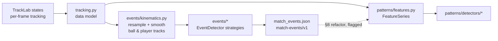

# Event Inference: Discrete Match Events from Tracking Data Alone

**Status:** designed + implemented against synthetic fixtures. The detectors under
[`/pipeline/events`](../pipeline/events/) are full implementations (not skeletons) with
unit tests pinning their semantics, in the same standard as the Phase 4 pattern
detectors. Nothing is validated against real tracking output yet; every threshold
carries provenance or an explicit "engine-original" flag (§10).

**Scope:** inferring discrete match events — passes, shots, crosses, corners,
throw-ins, goal kicks, kickoffs, set-piece restarts, and a coarse cause-agnostic
stoppage signal — from player + ball tracking positions only. Per review, the
deliverable for dead-ball play is **detecting and typing the restart** (Tier 1
boundary restarts + §5.3 set-piece organization); *why* the game stopped is a
referee decision, out of reach by agreement, and nothing here attempts to classify
it. No event feed, no
audio, no scoreboard OCR, no referee-signal interpretation.

**Relationship to the other design docs:** this layer sits **below Phase 4**
([phase4-5-design.md](phase4-5-design.md)). Phase 4's detectors — counter-attack above
all — currently rest on possession/turnover inference built from raw proximity; the
event stream designed here is the more truthful foundation that machinery should
eventually consume (§8: a traced, flagged refactor — deliberately not implemented in
this pass). Streaming implications are sketched in §9 against
[live-architecture-design.md](live-architecture-design.md).

---

## 1. Position in the pipeline



Phase 4 was designed around data reality #4 ("no event data", batch design §1.2): it
infers possession from proximity and treats everything else as invisible. That was the
right call for shipping shape/pressure detection, but it left the crudest inference —
"the ball went dead, someone has it now" — embedded inside the feature layer. This
document pulls event inference out into its own layer with its own honesty budget:
some events are genuinely recoverable from ball trajectory + pitch geometry, some are
recoverable with real uncertainty, and some are proxies we refuse to oversell.

Why now: pitch calibration works (Phase 2/3, `/research`), which is what makes
boundary geometry meaningful — a touchline crossing is only detectable if the
projected ball position is trustworthy to within tens of centimetres near the lines.

## 2. The confidence hierarchy (read this first)

The single most important design statement: **these events are not equally
inferable**, and the module structure, schemas, and confidence values all encode that
explicitly rather than pretending one detector family produces one quality of truth.

| Tier | Events | Physical basis | Honest expectation |
|---|---|---|---|
| **1 — reliable** | throw-in, corner, goal kick, kickoff | ball trajectory crossing a known line + the *restart morphology* (where play resumes from) | high precision once tuned; the restart position is ~40 m of separation between hypotheses — far outside any calibration noise |
| **2 — feasible, real uncertainty** | pass (+ short/long/through/cross/cutback subtypes), shot (attempt), set-piece organization | ball kinematics (launch/flight/reception) + player proximity + formation geometry | good on clean sequences; degrades honestly with ball-tracking dropouts, 5 Hz sampling, and partial visibility; sub-second events are at the recall floor |
| **3 — coarse signal** | stoppage | collective motion collapse + dead ball | a *segmentation* channel: "play is stopped here", nothing more — deliberately carries **no cause claim** of any kind |

Dead-ball play, the review-clarified framing: the useful deliverable is **"a restart
is happening, of this type"** — throw-in / corner / goal kick / kickoff from Tier 1,
free-kick-shaped setups from §5.3 — regardless of what caused the stoppage. Tier 3
exists only to make the stream segmentable into in-play / dead-ball phases through
one uniform channel.

And the refusals, stated once: we do **not** claim to detect fouls, offside *calls*,
cards, advantage played, why play stopped, or goals-with-certainty. Where a Tier 1/2
event can *corroborate* one of these (a kickoff following a goal-mouth shot), the
corroboration chain is explicit in the event metadata, never silently folded into a
confident label.

A second axis, orthogonal to the tier: **detection vs interpretation confidence**.
"A shot was struck" (detection) and "it was saved" (outcome interpretation) are
different claims with different reliability; shot events therefore carry a separate
`outcome_confidence`, exactly as pattern events separate `confidence` from
`intensity`.

## 3. Input: the kinematic layer

Event detectors do not consume `FeatureSeries` — deliberately. `FrameFeatures` holds
team aggregates (centroids, line heights) and, crucially, *possession inference*,
which §8 makes a **downstream consumer** of this layer; depending on it here would be
circular. Instead, [`events/kinematics.py`](../pipeline/events/kinematics.py) produces
a `KinematicSeries`: resampled, smoothed, per-player and ball position/velocity
tracks, segmented at broadcast cuts — features.py stages 1–2, without stages 3+.

Decisions worth their ink:

- **Same grid.** `resample_hz` and `max_gap_s` default to the feature layer's values
  (5 Hz, 1 s) so event timestamps land on the same grid as `FrameFeatures`
  timestamps — the §8 integration depends on this alignment.
- **Shorter ball smoothing.** The feature layer smooths the ball over 1 s because it
  wants stable trends; event inference wants *transients* (a kick is a velocity step).
  The kinematic layer smooths the ball over 0.4 s and players over 1 s. Consequence:
  ball speeds here differ slightly from `FrameFeatures.ball.speed` — two layers, two
  needs, documented rather than papered over.
- **Duplication is flagged, not hidden.** Segmentation/resampling logic is
  re-implemented here (the smoothing/derivative primitives are shared imports); the §8
  refactor extracts one shared resampling core both layers consume. Until then the two
  implementations are kept semantically identical on purpose.
- **Noise model.** One number matters everywhere in Tier 1: `boundary_noise_m`
  (default 0.5 m), the assumed 1σ position error near pitch lines. It is an
  engineering estimate of homography error at the pitch periphery — worse than at
  centre pitch, where the camera looks straight down the action — and it is a
  **measurement debt**: the first real calibrated match should replace it with a
  measured value (e.g. ball-at-rest scatter at known restart points).

The layer also owns **ball launch detection** — the shared primitive under every Tier
2 detector: a launch is a ball speed jump (≥ ~1.8 m/s between consecutive grid frames,
i.e. ≥ 9 m/s² — comfortably above Link & Hoernig's 4 m/s² kick-detection threshold,
conservative because our smoothing smears steps) or a sharp velocity redirect at
speed, attributed to the nearest player within 2.5 m in the preceding ~0.4 s.
*Honest ML note:* a learned kick/touch classifier on raw (unsmoothed, full-rate)
detections is the known-better replacement here; at 5 Hz smoothed, soft kicks under
~5 m/s are simply below our detection floor and short one-touch combinations blur
into single events. That recall floor propagates into every Tier 2 number.

## 4. Tier 1: boundary-crossing restarts

### 4.1 The evidence model: trajectory is weak near the line, morphology is strong

The naive detector — "ball position crossed the line ⇒ out" — is dishonest at exactly
the decision boundary: a ball 30 cm outside vs 30 cm inside the touchline is *within
our position noise*, and a hard boolean would flip on calibration jitter. The design
instead combines two evidence sources of very different strength:

1. **Exit evidence (weak near the line).** The smoothed trajectory crossing a
   boundary line, scored by its maximum excursion beyond the line against
   `boundary_noise_m` via the standard soft threshold: an excursion of 0 scores 0.5
   (genuinely ambiguous), 1σ scores ~0.73, 2σ+ approaches certainty. A ball that is
   *lost by the tracker* near a line while moving outward is also an exit candidate,
   at a discounted clarity — losing the ball as it leaves the pitch is the common
   broadcast case (camera pans away, crowd background).
2. **Restart morphology (strong).** What happens next is far more informative than
   the crossing itself: play stops, and resumes from a *rule-mandated location* —
   the touchline point for a throw-in, the corner arc for a corner, the six-yard box
   for a goal kick, the centre spot for a kickoff. These hypothesis locations are
   separated by tens of metres, ~two orders of magnitude above position noise. The
   resumption position is therefore the **primary classifier**; the crossing seeds
   the candidate and contributes a factor.

Confidence is the standard evidence product (geometric-mean combined, as
`episode_confidence` does for patterns): exit clarity × last-touch attribution ×
resumption geometry. There is no hard in/out boolean anywhere; a marginal crossing
with a clean stoppage-and-throw-in morphology emits a THROW_IN at moderate
confidence, and a marginal crossing where play visibly continues emits nothing.

Two honesty consequences, stated plainly:

- **Sub-sample clips are invisible.** A ball out and back inside within <0.4 s (one
  grid step) vanishes under resampling + smoothing. Real referees do call those;
  we structurally cannot. Recall for "ball barely out, play immediately restarted"
  is near zero and no threshold fixes it — only higher-rate tracking would.
- **A crossing without a stoppage is dropped.** If the ball exits by less than
  `definite_out_m` (2σ) and is back in play within ~2 s with no restart morphology,
  we discard the candidate — the honest reading is "noise, or the assistant kept the
  flag down", and we cannot tell which.

### 4.2 Last-touch attribution (and when to overrule it)

The restart *type* on goal-line exits depends on who touched the ball last (attacker
⇒ goal kick, defender ⇒ corner). We attribute last touch as the nearest player within
2.5 m in the ~1 s before the crossing — and this is the weakest link in Tier 1:
deflections (the canonical corner-vs-goal-kick decider) happen between our samples
and inside our smoothing window.

The design rule: **when attribution and resumption geometry disagree, geometry
wins.** If the last visible touch says "attacker" but play resumes from the corner
arc, the referee saw a deflection we didn't; classify CORNER, discount confidence,
and set `attribution_conflict: true` in metadata so the disagreement is auditable
rather than silent.

### 4.3 The four detectors' geometry

All boundary geometry uses the canonical 105 × 68 pitch (goal mouth |y| ≤ 3.66 m,
penalty box 16.5 m × 40.32 m, six-yard box 5.5 m × 18.32 m, corner arcs at the four
(±52.5, ±34) points; `MatchMeta.attack_direction` maps goal-line side to
defending team per period).

| Restart | Exit evidence | Resumption evidence | Team attribution |
|---|---|---|---|
| **Throw-in** | crossing of y = ±34 | ball at rest / relaunched within ~4 m of the crossing point on that touchline | opponent of last touch; taker's team as cross-check |
| **Corner** | crossing of x = ±52.5 outside the goal mouth | relaunch within ~3 m of a corner point on that goal line | attacking team (defender touched last) |
| **Goal kick** | same crossing | relaunch from within (or just beyond) that goal's six-yard box | defending team (attacker touched last) |
| **Kickoff** | none — no boundary is crossed | ball at rest within ~2 m of the centre spot ≥ 1 s, both teams ≥ 75% in own halves, then a launch | the team whose player takes it |

Kickoff is detected independently of any exit (it follows goals and starts periods)
and doubles as the **goal corroborator** for §5.2 — the only tracking-only evidence
that a goal-mouth shot actually scored.

A contract difference from pattern detectors, called out because it is deliberate:
**restart detection is not segment-local.** The broadcast almost always cuts between
the ball going out and the throw-in being taken; exits are linked to resumptions
across segment boundaries (bounded by ~90 s), with `resumption_observed: false` and a
confidence discount when the restart itself happened off-camera. Pattern detectors
must never span a cut (an episode is continuous evidence); a restart *is* a
discontinuity, so the rule inverts.

## 5. Tier 2: kinematic events

### 5.1 Passes

**Model.** A pass is a launch → flight → reception arc: a launch (§3) attributed to
player A; a flight during which the ball separates from A by ≥ ~2.5 m (else it is a
carry/dribble — rejected); a reception at the first frame the ball is controlled by
some player B (proximity within ~2 m with the flight visibly ending, or a new launch
— the one-touch case). Outcomes: `completed` (B teammate), `intercepted` (B
opponent), `out_of_play` (flight exits the pitch), `unresolved` (tracking lost the
flight). An intercepted pass is precisely a **turnover with a timestamp and a
location** — the thing Phase 4's counter-attack detector currently has to
reconstruct from 2 s of possession hysteresis (§8).

**Subtype ladder** (metadata, with its own `subtype_confidence` — the subtype is
always less certain than the pass itself). Evaluated in order, all geometry in the
passer's team-relative frame:

| Subtype | Definition | Honest caveat |
|---|---|---|
| `cutback` | launched from the byline strip (x' ≥ ~94) in a wide channel, travelling *backward* into the central box zone | solid geometry; rare enough that thresholds are engine-original |
| `cross` | launched from a wide channel (wide lane per the feature layer's 5-lane scheme) in the attacking zone (x' ≥ ~70), arriving in/at the penalty box, with net movement toward the centre | we cannot see height — a driven ground ball into the box and a floated cross are identical in 2D; "cross" here means *trajectory shape*, not aerial delivery |
| `through_ball` | forward pass received *beyond* the opposing defensive line (second-deepest opposing outfielder at launch, matching `def_line_height`'s convention) | needs the opposing line on camera; when < 4 opposing outfielders are visible the subtype is withheld (`line_visible: false`) rather than guessed |
| `short_pass` / `medium_pass` / `long_pass` | launch→reception distance < 15 m / 15–30 m / ≥ 30 m | bucket edges are engine-original convention, not standards |

**What degrades and why** (propagated into confidence, not hidden): ball-tracking
dropout mid-flight (the most common failure — long diagonals at broadcast zoom);
5 Hz recall floor on short quick combinations (a give-and-go can be one launch to
us); receiver ambiguity in crowded boxes (nearest-player-within-2 m is a guess in a
six-yard-box scramble). *Honest ML note:* pass detection is the sub-problem with the
strongest published tracking-only precedent (Vidal-Codina et al. 2022 detect passes
from 25 Hz stadium tracking with high agreement vs event data) — but that is clean,
full-pitch, 25 Hz data. Expect visibly worse recall here, and treat their method
(and a learned receiver model) as the upgrade path once real data exists.

### 5.2 Shots

**Attempt detection** (the reliable half): a launch from inside a plausible shooting
zone (≤ ~35 m from goal centre), with velocity pointing at the goal — the projected
crossing of the goal line falls within the goal mouth ± noise margin — and speed
above a soft ~9 m/s floor. Attempt confidence is the product of those three margins
× kicker attribution.

**Outcome classification** (the honest-ladder half). What tracking alone can and
cannot distinguish, stated as the design rather than discovered as a bug:

| Outcome | Evidence chain | Reliability |
|---|---|---|
| `goal` | goal-mouth trajectory + (ball crosses the line in the mouth *or* dies near it) + **a KICKOFF restart follows** (Tier 1 corroboration) | the only strong goal signal we have; still indirect — scoreboard OCR is the known-better source and is out of scope here |
| `saved` | flight reverses/dies at an opponent within ~2.5 m who is the goalkeeper or within ~6 m of the goal line | moderate; keeper-catch vs parry not distinguishable |
| `blocked` | same reversal signature at an outfielder well off the goal line | moderate |
| `off_target` | tracked crossing outside the mouth, or a GOAL_KICK restart follows | good when the flight is tracked |
| `unresolved` | flight lost, no corroborating restart observed (broadcast cut) | reported as exactly that |

**The 2D blind spot, stated bluntly:** we have no ball height. A shot over the bar
and a shot into the top corner have *identical* (x, y) trajectories. Every "on
target"-flavoured claim from this detector is planar; the restart that follows
(kickoff vs goal kick) is what actually disambiguates, ex post. Anything finer
(woodwork, tipped-over, top-corner vs row Z) requires a signal we do not have —
scoreboard OCR for score changes is the pragmatic one and is explicitly a separate,
future work item, not smuggled in here.

Because outcome and attempt are different claims, events carry `outcome_confidence`
separately from `confidence`, and `restart_after` names the corroborating Tier 1
event when one was found. A shot with `outcome: unresolved` at high attempt
confidence is a *good* detection honestly labelled, not a failure.

### 5.3 Set-piece organization — the primary dead-ball deliverable

Together with the Tier 1 restarts, this detector is what "dead-ball phase
detection" *means* in this design (per the review clarification): recognize that a
dead-ball restart is happening and roughly type it — throw-in / corner / goal kick
/ kickoff come typed from Tier 1 already; this detector covers the remainder, the
free-kick-shaped restarts, by their organizational signature. It flags **"a
dead-ball restart happened here"** with rough location, *without* claiming to know
why the game stopped (a referee decision, out of reach by agreement). It exists
because Tier 1 only explains stoppages that begin with a boundary crossing; free
kicks — the tactically interesting restarts — begin with a whistle we cannot hear.

Signature: a dead spell (ball at rest or untracked, collective player speeds
collapsed) lasting ≥ ~6 s, whose *tail* shows static set-piece organization, ended by
a launch (the delivery). Organization signals, strongest first:

- **a wall**: ≥ 3 same-team players in a tight line (adjacent spacing ≤ ~2 m,
  perpendicular spread ≤ ~1 m) in the 6–12 m annulus around the dead-ball point,
  goal-side of it — the 9.15 m rule makes this geometry near-diagnostic of a direct
  free kick;
- **box loading**: both teams committing ≥ 3 players into a penalty area while the
  ball is dead outside/at the edge of it — wide free kicks and (already-classified)
  corners;
- **static-only**: a dead spell with players merely stationary — emitted at low
  confidence as `organization: static_only`; could be an injury pause or a drinks
  break, and the metadata says so.

Spans overlapping an already-classified Tier 1 restart are skipped (the corner *is*
the classification); what remains is, by construction, "restart of unknown cause" —
overwhelmingly free kicks, but the event type deliberately says `set_piece_setup`,
not `free_kick`, because offside restarts and drop balls produce the same picture.
Metadata records the delivery (`runners_into_box` around the resumption) because
that is what a set-piece scouting consumer actually wants.

## 6. Tier 3: the coarse stoppage signal

Scoped narrowly on purpose (review clarification): this channel answers exactly one
question — **is play stopped right now?** — so the event stream can be segmented
into in-play and dead-ball phases. It does **not** classify cause, does not carry a
`possible_causes` list, does not try to distinguish a foul from an injury from an
offside call. Restart *typing* is Tier 1's and §5.3's job; cause is nobody's.

**Signature.** Two simultaneous collapses, sustained: *collective motion* (median
visible-player speed < ~0.7 m/s, i.e. standing/walking, for ≥ ~2.5 s) and *ball
activity* (ball at rest or lost by the tracker). Confidence is the stillness margin
× dead-ball evidence × visibility quality — nothing else.

**Uniform coverage, cross-referenced.** Unlike §5.3, stoppage events are emitted
for *every* dead phase, including those a Tier 1 restart or set-piece setup already
explains — a segmentation channel is only useful if it is complete. Each stoppage
carries `explained_by` metadata naming the overlapping higher-tier event type (or
`null` for an unexplained pause), so consumers can distinguish "typed restart" from
"play just stopped and we don't know more" without this detector ever claiming the
type itself.

**What richer stoppage understanding would need — named, and explicitly out of
scope:**

- **Referee tracking.** The data model already ingests `Role.REFEREE` detections
  (kept for debugging, unused). A referee sprinting to a spot and standing over it
  is the obvious corroborator for where and why play stopped — but referee track
  quality is unvalidated and the interpretation (signals, advantage arm) is a
  research problem. Not promised.
- **Whistle detection from broadcast audio.** Probably the single highest-value
  cheap signal for stoppage onset; entirely absent from our current input contract.
  Not promised.
- **Scoreboard/clock OCR.** The match clock freezing disambiguates injury stoppages;
  score changes confirm goals (§5.2). A separate work item with its own failure
  modes. Not promised.

These are listed so the limitation has a shape, not as a roadmap commitment.

## 7. Architecture

### 7.1 Module layout

```
pipeline/
  events/
    model.py        # MatchEvent, EventType, tiers, MatchEventStream, JSON schema
    kinematics.py   # KinematicSeries (resample+smooth), ball launch detection
    base.py         # EventDetector ABC, registry, evidence-combination helpers
    restarts.py     # Tier 1: throw-in / corner / goal kick / kickoff
    passes.py       # Tier 2: pass + subtype ladder
    shots.py        # Tier 2: shot attempt + outcome ladder
    setpieces.py    # Tier 2: set-piece organization
    stoppages.py    # Tier 3: coarse stoppage segmentation signal
    runner.py       # staged orchestration -> MatchEventStream -> match_events.json
    testing/
      synthetic.py  # scripted fixtures (reuses the patterns synthetic builder)
```

(Naming note: `pipeline/events` is *match* events — inferred things that happened in
the game. `pipeline/patterns/streaming/events.py` is the live *wire* schema for
pattern lifecycle messages. Unrelated namespaces.)

### 7.2 The detector idiom, and one deliberate deviation

`EventDetector` mirrors `PatternDetector`: one strategy class per event family, pure
`(KinematicSeries, context) -> List[MatchEvent]`, dataclass configs with every
threshold named, soft thresholds everywhere a hard cut would flap, registry +
runner with contained failures, synthetic-fixture tests pinning semantics.

The deviation: **detectors run in stages and see prior stages' output** (`context`).
Pattern detectors are deliberately independent (batch design §3.7); event detectors
are deliberately *not*, because the evidence really is layered — shot outcomes need
restarts (kickoff ⇒ goal), passes need shots (a launch is one or the other),
set-pieces need restarts (skip already-typed dead spells) and stoppages need both
(to cross-reference `explained_by`). Stage order:
restarts → shots → passes → set-pieces → stoppages. This is a dependency DAG frozen
in the runner, not detector-to-detector coupling; any detector still runs correctly
(more conservatively) with an empty context.

### 7.3 Output schema

One JSON document per match, versioned like its siblings:

```jsonc
// match_events.json (excerpt)
{ "schema": "match-events/v1",
  "match_id": "...",
  "events": [
    { "type": "corner", "tier": 1, "team": "home", "period": 1,
      "start": 731.4, "end": 758.2, "confidence": 0.81,
      "x": 52.5, "y": -34.0,
      "metadata": { "crossing_xy": [52.5, -21.3], "excursion_m": 1.4,
                    "last_touch_team": "away", "attribution_conflict": false,
                    "resumption_observed": true } },
    { "type": "pass", "tier": 2, "team": "away", "period": 1,
      "start": 803.0, "end": 804.6, "confidence": 0.72,
      "x": -21.5, "y": 8.0,
      "metadata": { "passer_track_id": 207, "receiver_track_id": 209,
                    "outcome": "completed", "length_m": 24.3, "forward": true,
                    "subtype": "long_pass", "subtype_confidence": 0.66 } },
    { "type": "stoppage", "tier": 3, "team": null, "period": 2,
      "start": 2911.0, "end": 2934.2, "confidence": 0.58,
      "x": -3.0, "y": 12.5,
      "metadata": { "explained_by": null, "ball_observed_fraction": 0.4 } } ] }
```

Conventions: `team` is the event's protagonist (thrower, passer, shooter, restart
taker) and may be `null`; `(x, y)` is the defining location in absolute pitch
coordinates; `tier` travels on every event so consumers can filter by honesty class
without a lookup table; timestamps are footage seconds on the 5 Hz grid, shared with
`FrameFeatures`.

### 7.4 Testing

Same standard as Phase 4: deterministic synthetic fixtures
(`events/testing/synthetic.py`, reusing the patterns scenario builder) scripting each
event's textbook positive *and* its deliberate negatives — ball-brushes-the-line
(no event), ambiguous 0.3 m excursion with clean restart morphology (event at
moderate confidence — the confidence *band* is itself asserted), dribble that must
not read as a pass, pass scenario that must not read as a shot, slow circulation
that must not read as a stoppage, deflection where geometry must overrule
last-touch attribution. Run with the existing suite:
`python3 -m unittest discover -s pipeline/tests`.

## 8. Phase 4 integration: the traced refactor (flagged, not implemented)

This is a real seam, not parallel work. Today, `features.py` infers three things from
raw proximity that this layer now infers better; here is exactly what changes and
what stays. **None of this is implemented in this pass** — it lands as a follow-up
after this design is reviewed, because it changes Phase 4's measured behaviour and
should be diffed against the synthetic suite in isolation.

### 8.1 What changes in `features.py`

`FeatureExtractor._infer_possession` (the stage-3 state machine) gains an optional
`events: MatchEventStream` input and three amendments:

1. **DEAD spans come from restart events, not the out-of-bounds margin.** Today a
   frame is DEAD iff the smoothed ball sits ≥ 0.5 m outside the pitch
   (`out_of_bounds_margin_m`) — so the dead time between a crossing and the throw-in
   is mostly labelled by whatever the (missing) ball last implied, and a ball 0.3 m
   out is "in play". With events: every frame inside a restart event's
   [crossing, resumption] span is DEAD. The margin check remains only as a fallback
   for matches processed without an event stream; `out_of_bounds_margin_m`
   effectively retires with it.
2. **Turnover anchors gain event backdating.** Today a turnover exists only after
   2 s of sustained new-team proximity (`turnover_persistence_s`), backdated to the
   flip. With events: an `intercepted` pass creates a turnover at the *reception
   frame* (won by the receiver's team) — sharper in time and location than
   proximity hysteresis, which stays as the fallback for scrambles, tackles, and
   loose-ball regains that no pass event explains. The persistence rule is unchanged
   for event-less flips, so behaviour degrades gracefully to today's exactly.
3. **Restart re-establishment becomes attributed.** Today the first clear holder
   after a DEAD spell establishes possession with no turnover event. With events:
   the restart type names the receiving team (throw-in to X, goal kick to X) at the
   resumption frame, before any holder is visibly within 2 m — earlier and
   deterministic. Still no turnover event, preserving the documented "restarts do
   not create counter-attack anchors" rule — which stops being a simplification and
   becomes literally true.

**What stays untouched:** resampling/smoothing (stages 1–2), the per-frame proximity
`raws` computation, contested logic, holder tracking, shape/pressure/lane assembly
(stages 4–6), the entire `FeatureSeries` interface, every detector config and
threshold. The Phase 4/5 boundary (`MatchPatternProfile`) is unaffected.

### 8.2 What downstream Phase 4 code should then consume

- **`counter_attack.py`** — no code change required (it anchors on
  `possession.turnover_won_by`, which simply gets better); one enrichment flagged:
  `metadata["turnover_type"] = interception | regain` from the originating event, a
  breakdown Phase 5's scouting rules can key on.
- **`high_press.py`** — the "goal kick vs open play" trigger metadata (batch design
  §3.2) currently reads a preceding DEAD state; it should read a preceding
  GOAL_KICK event instead — same field, sharper source.
- **`flank_overload.py`** — the documented throw-in-huddle false positive (batch
  design §3.4) gets its designed fix: suppress overload frames inside restart event
  spans.

### 8.3 Phase 4 assumptions this changes (re-validate on integration)

- **Turnover counts and timing shift** — interception-backed flips confirm ~2 s
  earlier than hysteresis-backed ones, so counter-attack windows open earlier and
  some near-miss counters will newly clear the progression-speed bar.
  `test_detectors.CounterAttackDetectorTest` timing assertions (anchor ±1.5 s) will
  need their tolerances re-derived, and real-data counter rates re-baselined.
- **Possession-share style numbers change** — longer, truer DEAD spans reduce both
  teams' possession-state seconds; anything normalising by possession time (scouting
  aggregates) must re-baseline.
- **`turnover_persistence_s` tuning assumption weakens** — 2 s was calibrated to
  proximity noise; event-backed flips don't need it. Leave it for the fallback path;
  do not retune it against event-backed data.
- **The flickering-possession test stays green by design** — a 1 s fake interception
  still confirms nothing unless a pass event says otherwise, and the synthetic
  flicker scenario contains no launch-reception arc.

## 9. Live/streaming implications (short, per the brief)

Against the live architecture's parity principle and lifecycle machinery
(live design §2, §4), the event detectors sort cleanly by *when their evidence
completes*:

| Detector | Streaming fit | Evidence horizon |
|---|---|---|
| stoppage signal | causal, easy | ~3 s (the sustain window) — episode-machine shaped |
| pass | causal | flight time, ≤ ~4 s; PROVISIONAL at launch, resolve at reception — `AnchoredWindowMachine` shaped |
| shot attempt | causal | ~1 s after launch |
| set-piece organization | causal with natural delay | PROVISIONAL while the wall forms, CONFIRMED at the delivery — tens of seconds, all forward-looking |
| restart classification | causal, **long** resolution | exit is instant; *classification* completes at the resumption — up to ~40 s of dead time, spanning cuts |
| shot **outcome** | the outlier | goal corroboration waits for a kickoff — up to ~60 s later; other outcomes resolve in ~4 s |

Nothing here is *fundamentally* batch-only in the sense of needing future frames
beyond a bounded horizon — but the last two exceed anything the current streaming
machines hold open (`merge_gap_s`-scale gaps), and restart classification
deliberately crosses segment breaks, which the live segment state machine treats as
hard resets. Live event inference therefore needs one new lifecycle shape — a
**pending-resolution machine** ("event emitted, classification/outcome upgrades
later") that survives BROKEN segments — plus UI semantics for late upgrades
("shot… ⚽ goal" 40 s later). That is a real design task of its own and is
explicitly future work, not smuggled into this pass; the batch detectors here are
the reference implementation live must reproduce, per the parity principle.

## 10. Threshold provenance

Same discipline as the batch design's §9: every value either cites a source or is
flagged engine-original. New literature was not fetched for this pass; citations
below are to sources already verified in the July 2026 pass (batch design §8).

| Parameter | Default | Provenance |
|---|---|---|
| Kick/launch: ball acceleration | ≥ ~9 m/s² (1.8 m/s per 5 Hz step) | Link & Hoernig 2017 use ≥ 4 m/s²; ours is deliberately higher because 0.4 s smoothing smears steps — **engine adaptation, mechanism cited** |
| Launch: min resulting speed | 4.5 m/s | **engine-original** (below it, kicks are indistinguishable from carries at our noise) |
| Control/reception radius | 2.0 m | matches the possession radius: published 0.5–1 m at 25 Hz, enlarged for broadcast per Vidal-Codina et al. 2022 |
| Kicker/touch attribution radius | 2.5 m | same basis, slightly enlarged for lookback attribution — **engine-original margin** |
| Pass separation (dribble rejection) | 2.5 m | **engine-original** |
| Boundary noise (1σ near lines) | 0.5 m | **engineering estimate — measurement debt**, replace with measured calibration error |
| Definite-out excursion | 1.0 m (2σ) | derived from the above |
| Restart resumption tolerances | 3–4 m | rule geometry (corner arc 1 m, six-yard box) + noise — **engine-original margins** |
| Wall geometry | ≥ 3 players, ≤ 2 m spacing, 6–12 m annulus | the 9.15 m law + observed wall widths — **engine-original formalisation** |
| Shot zone / speed | ≤ 35 m from goal, ≥ 9 m/s soft | **engine-original**; goal-mouth projection is the real discriminator, speed is secondary |
| Pass length buckets | 15 m / 30 m | **engine-original convention**, no published standard adopted |
| Stoppage speeds | players < 0.7 m/s, ball < 0.5 m/s | **engine-original**, far below the 5.5 m/s HSR band — these are stand-still thresholds |
| Wide-channel / box geometry | lanes per feature layer; box 40.32 × 16.5 m | pitch law + the batch design's lane scheme |

Standing caveat, inherited from the batch design and doubled here: thresholds were
set against synthetic fixtures and literature mechanics, not real broadcast tracking.
The validation loop (batch design §7 — the annotator tool already exports compatible
JSON) applies to events exactly as to patterns, and Tier 2 subtype thresholds are
the first thing real data will move.
