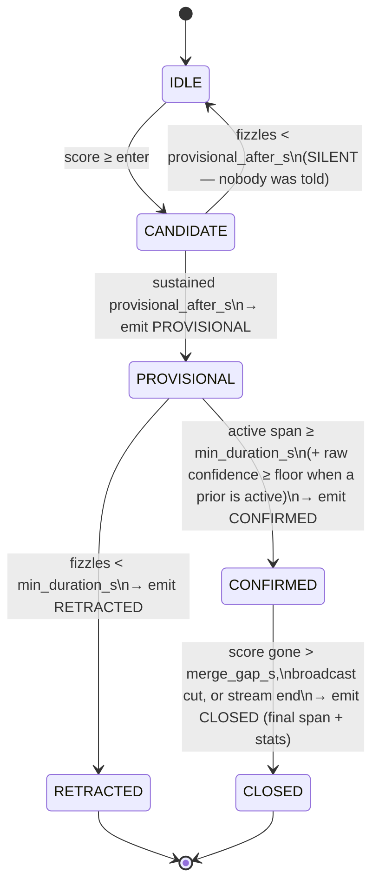
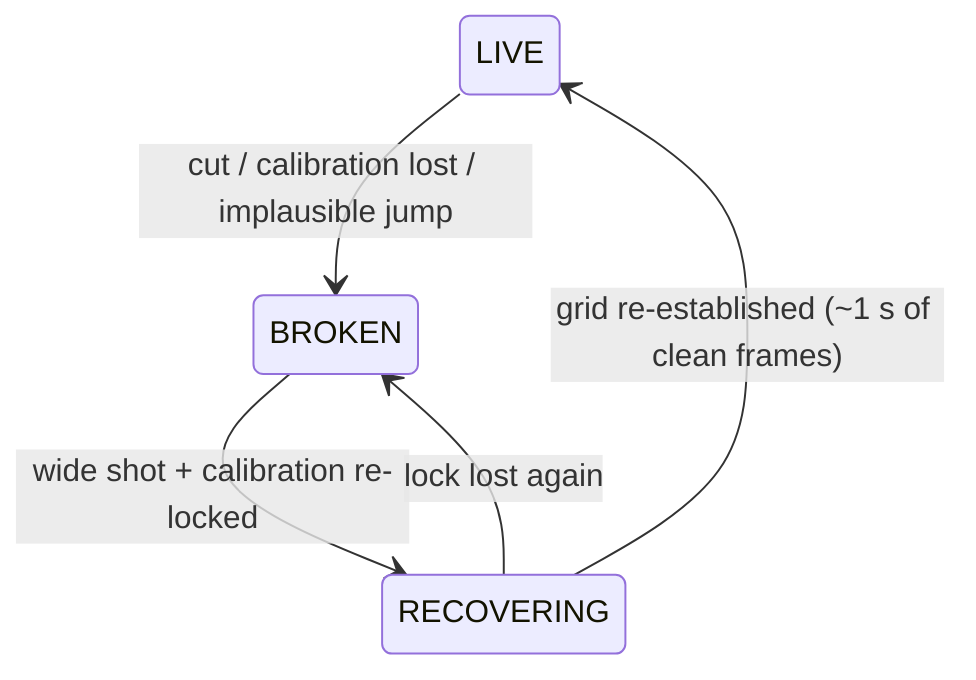
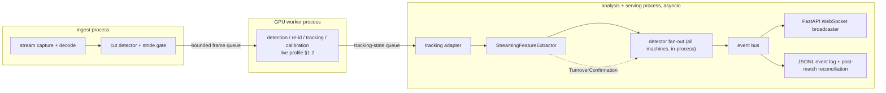

# Live/Streaming Architecture: Running Pattern Detection During a Broadcast

**Status:** design + partial implementation. The causal core (delayed-exact smoothing,
possession machine, episode lifecycle machines, live event schema) is implemented and
tested under [`/pipeline/patterns/streaming`](../pipeline/patterns/streaming/); the
streaming feature-extractor assembly and the service layer are skeletons/design-only,
pending the same real-tracking-data validation the batch pipeline gets first. Every
throughput number in §1 is an engineering estimate to be replaced by measurements from
the `/research` benchmarking runs.

**Relationship to the batch design:** this document extends
[phase4-5-design.md](phase4-5-design.md). Everything there (feature catalog, detector
heuristics, thresholds, §9 provenance) is unchanged; this document is about running the
same logic frame-by-frame with bounded latency.

---

## 1. What "live" can honestly mean

### 1.1 Throughput reality: the GPU stage is the whole problem

The upstream stack (sn-gamestate/TrackLab: detection → re-id → tracking → calibration →
jersey OCR) is built for offline research, and on our reference GPU (T4) the default
configuration runs well below real time. Component-level estimates at 720p:

| Stage | Est. per frame (T4) | Notes |
|---|---|---|
| decode | ~5 ms | NVDEC; negligible |
| person/ball detection | 25–40 ms | YOLO-class detector, batchable |
| re-id embeddings | 30–80 ms | ~12–16 crops/frame; batchable |
| tracking association | 5–15 ms | CPU |
| calibration (TVCalib) | 200 ms – 1 s+ | **dominant**: per-frame optimization |
| jersey OCR | 50–150 ms | only helps long-term track stitching |

Default stack total: roughly **0.4–1.5 s/frame ⇒ 0.7–2.5 fps** — a 25 fps broadcast is
out of reach by an order of magnitude, and even our 5 Hz analysis grid is 2–7× short.
The deficit is dominated by one component: optimization-based per-frame calibration.

### 1.2 The live profile

Live operation therefore runs a modified upstream configuration ("live profile"):

1. **Sparse calibration + homography tracking.** Calibrate from pitch keypoints at
   ~1 Hz (or on demand when drift is detected) with a lighter keypoint-regression
   calibrator, and track the homography between keyframes. This attacks the dominant
   cost directly.
2. **No jersey OCR live.** OCR only aids long-horizon track stitching, which Phase 4
   features don't require (they tolerate ID switches by design).
3. **Analyze at the feature grid rate, not the video rate.** Features were designed for
   2–10 Hz (batch design §1.2); we run GPU inference only on grid frames (5 Hz target,
   2 Hz floor).
4. **Batched inference** across the small frame stride where the models allow it.

Estimated live-profile cost: **~100–200 ms per analyzed frame ⇒ 5–10 fps**, i.e. a 5 Hz
grid is *plausible but tight* on one T4, and 2 Hz is safe. This is the single most
important number to measure early; the design below treats the sustainable rate as a
config value, not an assumption, and every downstream component already works at 2 Hz.

**The queueing law that shapes everything:** if sustained throughput is even slightly
below the input rate, queue latency grows without bound. The ingest gate therefore
*adapts the analysis stride* to the measured GPU throughput (drop to 4 Hz, 3 Hz, … as
needed) so that at most 1–2 frames are ever in flight and pipeline latency stays bounded
— a slightly coarser grid with bounded latency beats a fine grid drifting minutes behind
the match. Detectors already gate on data quality, and a coarser grid is just another
quality regime.

### 1.3 The latency budget

End-to-end, from a tactical shape existing on the pitch to the analyst seeing an alert
(5 Hz live profile, defaults):

| Contribution | Latency | Source |
|---|---|---|
| ingest buffer + decode | 0.2–0.5 s | engineering estimate |
| GPU stage (inference + in-flight queue) | 0.2–0.6 s | estimate; §1.2 |
| feature-layer structural delay | 0.5–1.1 s | **exact** — `feature_latencies()`, §3.2 |
| turnover confirmation (transition patterns only) | +2.0 s | possession persistence rule |
| detection: first PROVISIONAL alert | +1.5 s of sustained pattern | `provisional_after_s`, §4 |
| detection: CONFIRMED | +3–12 s (pattern's `min_duration_s`) | batch parity |

Bottom line, stated plainly:

- **PROVISIONAL alert ≈ 2.5–4 s after a pattern starts** (≈ 5–6 s for turnover-anchored
  counter-attacks);
- **CONFIRMED ≈ the pattern's own duration bar + ~1.5–2 s of pipeline overhead** — a
  press confirms ~5 s in, a low block ~14 s in.

So "live" here means **within-the-same-possession-phase alerting**, not
before-the-pass prediction. That is the honest ceiling of this stack, and it is enough
for the actual user: a bench analyst works on a 10–60 s decision cadence, and "they've
gone to a high press" 4 seconds into a press that lasts twenty is actionable
intelligence. Sub-second "the trap is being sprung NOW" alerting is **out of scope**
— it would require a fundamentally different (stadium multi-camera, edge-deployed)
pipeline. Note also that broadcast transport itself is typically seconds-to-tens of
seconds behind the stadium; our processing latency is of the same order as the delay
already baked into the feed.

### 1.4 Where the bottleneck sits (and the design consequence)

Everything downstream of tracking — features, detectors, aggregation, WebSocket fan-out
— is stdlib Python arithmetic on ≤ 22 points at 5 Hz: **microseconds per frame, three
orders of magnitude below the GPU stage.** The design consequence: the analysis tier
needs *correctness* engineering (causality, lifecycle, recovery), not performance
engineering. Parallelizing detectors, queueing between features and detectors, or
rewriting the feature layer for speed would be architecture theater. There are exactly
two real queue boundaries in the system, both around the GPU (§6).

---

## 2. The parity principle

The cornerstone of the streaming design:

> **The live path computes the same numbers as the batch path, later — never different
> numbers sooner.**

Batch smoothing is centered (sees the future); batch velocities are central
differences; batch possession backdates turnovers. The naive streaming translation —
one-sided exponential smoothing, backward differences, undelayed possession — produces
*different values*, which silently invalidates every threshold tuned in the offline
validation loop (batch design §7) and makes live behaviour untestable against batch
ground truth.

Instead, the streaming helpers ([`causal.py`](../pipeline/patterns/streaming/causal.py))
keep the exact batch math and buy causality with **delay**: the smoothed value for time
*t* is emitted once *t + half-window* has arrived. Parity is enforced by construction
(each emitted value is computed by the batch helper over a window-sized slice) and by
tests asserting bit-equality against the batch functions on randomized inputs,
including `None` runs.

Consequences worth spelling out:

- every threshold, softness, and duration tuned offline transfers to live unchanged;
- a live episode and the post-match batch episode over the same frames are **the same
  episode** — same span, same confidence (parity-tested in
  `test_streaming_detector.BatchParityTest`);
- the post-match batch run over the recorded frames remains the **audit record**; live
  output never contradicts it, it only *precedes* it (and adds lifecycle events batch
  doesn't have);
- the cost is ~0.5–1.1 s of structural delay (§3.2) — invisible next to the GPU stage.

The two places causality forces a genuine (documented, bounded) divergence:
possession-flip backdating (§3.3) and two episode metadata tags computed at onset
instead of over the whole episode (`is_counter_press`, noted in
[`streaming/high_press.py`](../pipeline/patterns/streaming/high_press.py)).

---

## 3. Streaming feature extraction

### 3.1 Stage-by-stage conversion

`FeatureExtractor` (batch) sees a whole segment; `StreamingFeatureExtractor` sees one
frame at a time. Every stage is either *per-frame pure* (no change needed) or
*delayed-exact* (converted via `causal.py`):

| Stage | Batch | Streaming | Kind |
|---|---|---|---|
| resample to grid | interpolate across gaps ≤ 1 s | hold a grid point back until the closing observation arrives (bounded by `max_gap_s`) | delayed-exact |
| smooth positions | centered moving average | `StreamingMovingAverage` (half-window late) | delayed-exact |
| velocities | central difference | `StreamingDerivative` (1 sample late) | delayed-exact |
| possession | state machine, backdated flips | `StreamingPossessionMachine` + `TurnoverConfirmation` events | causal w/ documented divergence |
| shape/pressure/lane assembly | per-frame geometry | identical code path | per-frame pure |
| line velocity / closing speed | derivative then smoothed | `CausalChain(derivative, moving_average)` | delayed-exact |
| quality | per-frame | identical | per-frame pure |

### 3.2 Minimum history and structural delay per feature

Computed, not hand-waved: `streaming.features.feature_latencies(config)` derives the
table from the extractor config (values below at 5 Hz / 1 s window defaults; tested):

| Feature family | Emission delay | Warm-up to mid-segment quality |
|---|---|---|
| positions, shape, lanes, pressure counts | 0.5 s | 0.4 s |
| player/ball velocities, `n_forward_runners` | 0.7 s | 0.6 s |
| `def_line_velocity`, `press_closing_speed` | 1.1 s | 1.0 s |
| `possession.state` | 0.5 s | 0 |
| turnover confirmation (anchor events) | 2.5 s | 0 |

**Startup transient.** After a segment start there is deliberately no "not enough
history yet ⇒ emit None" regime: the causal helpers emit edge-shrunk values from the
first frame, *exactly as batch does at a segment's first frames* — so early values are
merely as noisy as batch segment edges, a regime every detector already survives.
The honest warm-up figure above is the time until values match mid-segment quality;
all warm-ups sit far below the shortest episode gate (3 s `min_duration_s`), which is
what actually protects detectors from acting on transients (asserted in
`test_streaming_features`).

### 3.3 Possession, causally

The batch possession machine backdates confirmed flips — it rewrites the 2 s of frames
between first touch and confirmation. Live frames are immutable once emitted, so
[`StreamingPossessionMachine`](../pipeline/patterns/streaming/possession.py) makes the
causal version of the same decision:

- during a pending flip, frames keep reporting the old holder (which is exactly what
  batch's pre-rewrite pass says);
- on confirmation it emits a `TurnoverConfirmation` carrying the **backdated start
  time** — the live analogue of the batch rewrite.

This is the single point where live and batch feature streams differ, and it is
bounded: the divergence lasts at most `turnover_persistence_s` (2 s) and is resolved by
an explicit event. Turnover-anchored consumers (streaming counter-attack) receive their
anchor 2 s late but with the true start time, and evaluate their window from the
backdated anchor — so the *window* is identical to batch's, only its evaluation starts
2 s in. Everything else in the machine mirrors the batch branch structure one-to-one
(DEAD resets without turnover events, missing-ball persistence, contested frames
keeping the pending clock alive) so drift has nowhere to hide.

---

## 4. Streaming pattern detection: the instance lifecycle

### 4.1 The problem with episodes, live

Batch extracts episodes *after the fact*: threshold the whole score series, merge gaps,
drop short spans. Live there is no "after" — we need "this looks like it's starting"
with an honest downgrade path when it isn't. The design is a per-(pattern, team)
state machine ([`EpisodeStateMachine`](../pipeline/patterns/streaming/detector.py)):



Dormancy (score dipping below the exit threshold) is tracked inside the open states:
a dip shorter than `merge_gap_s` resumes the same instance — reproducing batch's
gap-merging exactly, including committing the gap frames into the episode's confidence
window only when the episode actually resumes.

### 4.2 Parity contract and the two-tier false-start defence

**Parity:** for any score series, the set of CLOSED instances equals
`episodes_from_scores(...)` spans with identical confidences (randomized-series tests,
7 seeds). PROVISIONAL/RETRACTED traffic is *live-only additional information*, never a
contradiction of batch.

**False starts** are handled in two tiers, because the failure modes differ:

1. **Candidates are free.** A 1-second pressure blip never surfaces: nothing is emitted
   until evidence has been sustained `provisional_after_s` (default 1.5 s). Tuning this
   is the earliness↔trust dial.
2. **Provisionals are accountable.** A provisional that fizzles emits an explicit
   `RETRACTED` so the UI can undo it, and the **retraction rate is a first-class live
   health metric**: if >~30% of provisionals retract, `provisional_after_s` is too low
   for current data quality (the service should surface this rate per match).

### 4.3 Two machine shapes, not one

The five batch detectors are not all the same shape, and pretending otherwise would
break the weakest ones:

- **Episode-shaped** (high press, low block, flank overload, offside-trap step-ups):
  per-frame score → hysteresis → episodes. These wrap directly:
  `StreamingDetector` + `EpisodeStateMachine`, with per-frame scoring **shared with the
  batch detector** — extracted to module level (`detectors.high_press.frame_score`) and
  called by both paths, so they cannot drift. `StreamingHighPressDetector` is the
  shipped worked example; the other three follow the same mechanical extraction
  (deliberately not done wholesale yet, to keep the batch-layer diff reviewable).
- **Anchored-window-shaped** (counter-attack): no per-frame "is a counter happening"
  score exists; the batch detector opens a 14 s window at a confirmed turnover and
  scores the window's *cumulative* facts (peak progression, peak runners).
  [`AnchoredWindowMachine`](../pipeline/patterns/streaming/detector.py) runs that
  lifecycle live: open on `TurnoverConfirmation` (2 s late, backdated anchor),
  PROVISIONAL the moment the cumulative score first clears the bar ("a counter is
  developing" — typically 3–6 s after the real turnover), resolve at window
  end/possession loss into CONFIRMED+CLOSED or RETRACTED.

Offside trap live: the step-up *events* run through the episode machine like any other,
but they inherit the batch detector's honesty problem (design doc §3.5) with less data,
so their provisional cap is lower and the genuinely useful live surface is different —
the **line-management tendency is a pre-match scouting artifact** (opponent-scouting
design §4), not a live alert. Expect the live offside-trap channel to be demoted or
disabled after the first validation pass; the architecture loses nothing if it is.

### 4.4 How confidence evolves over the lifecycle

Confidence stays the batch quantity throughout: `episode_confidence` over the frames
seen *so far* — i.e. at every instant, "what batch would say if the episode ended now."
Two live-only modifiers wrap it:

- **maturity** = active span / `min_duration_s`, capped at 1 — the "how partial is this
  partial episode" axis, deliberately separate from confidence and exposed in every
  event (a UI should render `maturity < 1` distinctly, e.g. a filling ring);
- **provisional cap** (default 0.8): until confirmation, reported confidence is capped
  so a 1.5-second screaming-strong candidate can never outrank confirmed events in the
  UI. The cap lifts at CONFIRMED; CLOSED confidence is exactly the batch value.

Both raw and prior-adjusted confidence travel in every event (§7).

---

## 5. Broadcast discontinuity, live

### 5.1 Detecting "the segment broke" vs "the data is noisy"

Batch discovers cuts retroactively from timestamp gaps. Live needs an explicit decision
with signals that arrive in this order (cheapest first):

1. **Shot-boundary detection** on raw frames (histogram/edge-delta heuristic, CPU,
   sub-ms) — catches hard cuts to replays/close-ups/crowd. *Honest ML note: heuristic
   cut detectors miss dissolves and wipes; a learned shot-boundary model (e.g.
   TransNetV2-class) is the known-better replacement and slots in behind the same
   interface.*
2. **Calibration confidence collapse** — the calibrator can't find the pitch (close-up,
   replay graphics, crowd). Sustained for ~0.5 s ⇒ break.
3. **Tracking evaporation** — person detections drop toward zero on what claimed to be
   a pitch view.
4. **Position-jump plausibility** — if *all* projected positions teleport at once, the
   homography snapped or we're in a look-alike replay: declare a break retroactively
   for the last grid frame and discard it.

Signal 4 is the honest answer to the hardest case: **wide-angle replays**, which look
like live wide shots to signals 1–3. They will sometimes leak through and create a
phantom segment with "time-travelling" play. Mitigations, in order of availability:
plausibility check (above), per-observed-minute rates (a leaked 8 s replay slightly
inflates counts but never fabricates a *tendency*), and later a small
replay-wipe/scorebug classifier — flagged as a genuine ML work item, not something a
threshold fixes.

### 5.2 The segment state machine



On **LIVE → BROKEN**: flush the causal delay lines (emitting the tail frames of the
dying segment with batch right-edge semantics), call `segment_break()` on every
detector machine — open CONFIRMED instances close (`reason: "broadcast_cut"`, exactly
where batch would end them), PROVISIONALs retract, candidates vanish silently — reset
the possession machine, increment `segment_id`, emit a `stream_status` message. During
BROKEN, the expensive GPU stage idles; only the cheap cut/pitch-visibility check runs
(a welcome throughput saving — replays are when the GPU gets to catch up).

On **RECOVERING → LIVE**: features restart with edge-shrunk windows (§3.2's warm-up
story). Nothing is carried across the gap: after 10+ seconds of replay the tactical
state genuinely may have changed, and batch makes the same choice (possession reset per
segment). The 2 s turnover-persistence and 3 s episode gates mean the system says
nothing for the first ~2–3 s after recovery — correct behaviour, not a bug: the same
epistemic humility batch applies at every segment start.

---

## 6. System architecture

### 6.1 Topology: two real queues, one honest process layout



- The **two queue boundaries are the two real ones**: into and out of the GPU stage
  (different processes because the GPU worker is CUDA-bound and must never be blocked
  by Python serving work). Both queues are bounded; the frame queue drops-oldest and
  the stride gate adapts (§1.2) so latency stays bounded under load.
- **Everything in P3 is one asyncio task per match.** Features → detectors → bus is
  synchronous function composition: at ≤ 10 Hz × microseconds of work, worker pools and
  inter-detector queues would add failure modes and reorder events for zero gain
  (§1.4). Detector fan-out is a `for` loop over registered streaming detectors.
- **Persistence:** every `LivePatternUpdate` appends to a JSONL log keyed by
  `instance_id`. Post-match, the recorded tracking frames re-run through the *batch*
  pipeline to produce the canonical `events.json`/`profile.json` (the audit record,
  §2); a reconciliation report maps live instances to batch episodes and computes the
  retraction/divergence stats that feed threshold tuning.

### 6.2 Module structure

```
pipeline/
  patterns/
    streaming/            # ← shipped (this design)
      causal.py           # delayed-exact smoothing/derivative primitives
      possession.py       # causal possession machine + TurnoverConfirmation
      features.py         # StreamingFeatureExtractor (skeleton) + latency table
      detector.py         # EpisodeStateMachine, AnchoredWindowMachine,
                          #   ConfidencePrior protocol, StreamingDetector base
      high_press.py       # worked example wrapping the shared batch scorer
      events.py           # LivePatternUpdate lifecycle + WS wire schema
  live/                   # ← future service layer (design-only)
    sources.py            # stream capture: file/RTMP/HLS -> frames
    gate.py               # cut detection, pitch-visibility, stride adaptation
    gpu_stage.py          # live-profile TrackLab wrapper, queue protocol
    bus.py                # event bus, JSONL sink, seq numbering
    service.py            # FastAPI app: WS endpoint, snapshots, health
    reconcile.py          # post-match live-vs-batch reconciliation
```

### 6.3 WebSocket contract (the Kotlin Compose client's view)

Endpoint: `GET /ws/live/{match_id}` (upgrade). On connect the server sends a snapshot,
then deltas. All messages carry `v` (schema version) and a monotonic `seq` — the client
detects gaps and re-requests a snapshot rather than trusting a holey stream.

```jsonc
// on connect — rebuild UI state after reconnects without replaying history
{ "v": 1, "seq": 41, "type": "snapshot",
  "stream": { "state": "live", "segment_id": 14, "quality": 0.82 },
  "open_instances": [ /* full instance objects, shape as below */ ] }

// a press starts: first, retractable alert (~4s after the real onset, §1.3)
{ "v": 1, "seq": 812, "type": "pattern", "event": "provisional",
  "instance": { "id": "high_press:away:3", "pattern": "high_press", "team": "away",
                "period": 2, "start_s": 2705.0, "last_s": 2706.6,
                "confidence": 0.44, "raw_confidence": 0.41, "maturity": 0.53,
                "intensity": 0.58,
                "metadata": { "trigger": "open_play", "is_counter_press": false },
                "prior": { "applied": true, "p_team": 0.71, "shift": 0.42 } } }

// evidence keeps accumulating (throttled to ~1/s per instance)
{ "v": 1, "seq": 815, "type": "pattern", "event": "update",
  "instance": { "id": "high_press:away:3", "last_s": 2708.0,
                "confidence": 0.57, "raw_confidence": 0.55, "maturity": 1.0, ... } }

// the batch bar is met: this instance will now never be retracted
{ "v": 1, "seq": 816, "type": "pattern", "event": "confirmed",
  "instance": { "id": "high_press:away:3", ... } }

// the press ends: final span + stats == what the post-match batch run will say
{ "v": 1, "seq": 831, "type": "pattern", "event": "closed",
  "instance": { "id": "high_press:away:3", "start_s": 2705.0, "end_s": 2716.4,
                "confidence": 0.68, "raw_confidence": 0.66, "intensity": 0.61, ... } }

// the other ending: a provisional that fizzled
{ "v": 1, "seq": 590, "type": "pattern", "event": "retracted",
  "reason": "score_faded", "instance": { "id": "flank_overload:home:1", ... } }

// stream health (also emitted on every segment transition)
{ "v": 1, "seq": 832, "type": "stream_status", "state": "broken",
  "segment_id": 14, "match_clock_s": 2716.4, "quality": 0.0, "open_instances": 0 }
```

Client rendering rules (the contract's intent, so the UI and pipeline agree on
semantics, not just shapes):

- key cards by `instance.id`; `provisional → confirmed` upgrades the card in place;
- render `maturity < 1` and `event: "provisional"` visually distinct (outline/pulse);
  never present a provisional as a fact;
- `retracted` removes the card (optionally to a dimmed "false starts" drawer — the
  analyst may want to see what the system almost said);
- `closed` moves the card to the match timeline; its span deep-links video exactly like
  a batch `PatternEvent`;
- on `stream_status.state != "live"`, grey the live panel — silence is a data gap, not
  tactical calm;
- on a `seq` gap: request `/ws` snapshot again.

Serialization is implemented and tested (`events.to_ws_dict`); the FastAPI wrapper
around it is future work in `pipeline/live/`.

---

## 7. Scouting priors: the hook (design in the companion doc)

Live detection accepts an optional per-(pattern, team) prior from the opponent
scouting profile ([opponent-scouting-design.md](opponent-scouting-design.md) §3),
through a deliberately narrow protocol (`ConfidencePrior`):

- may shift **reported confidence** (bounded log-odds shift, capped);
- may scale **`provisional_after_s`** (earlier first alerts for patterns this opponent
  is known for, later for out-of-character ones);
- may **never** touch per-frame scores or episode membership — live episode geometry
  stays batch-identical, priors or not;
- confirmation always requires **raw** confidence to clear an absolute floor — a prior
  accelerates belief, it cannot fabricate evidence;
- every emitted event carries both `raw_confidence` and adjusted `confidence` plus a
  `prior` block, so post-match reconciliation can measure exactly how much the prior
  bent live output.

## 8. What is implemented vs. design-only

| Piece | Status |
|---|---|
| causal smoothing/derivative primitives | **implemented + parity-tested** |
| streaming possession machine | **implemented + tested** |
| `EpisodeStateMachine` (lifecycle + batch parity) | **implemented + tested** (7-seed randomized parity) |
| `AnchoredWindowMachine` | **implemented + tested** |
| live event model + WS serialization | **implemented + tested** |
| `StreamingHighPressDetector` (shared scorer) | **implemented + tested** end-to-end on synthetic frames |
| structural latency table (`feature_latencies`) | **implemented + tested** |
| `StreamingFeatureExtractor` assembly | skeleton (stages exist; assembly pending real data) |
| low block / flank overload / offside trap wrappers | pending the same scorer extraction as high press |
| streaming counter-attack detector (window scorer) | design-only (§4.3) |
| cut detection / segment state machine / live profile | design-only (§1, §5) |
| `pipeline/live/` service, FastAPI/WS endpoint | design-only (§6) |

Measurement debts before any of §1's numbers are trusted: live-profile GPU throughput
on the reference card; calibration drift under homography tracking; cut-detector
precision/recall on real broadcast footage; provisional retraction rate at default
`provisional_after_s`.
