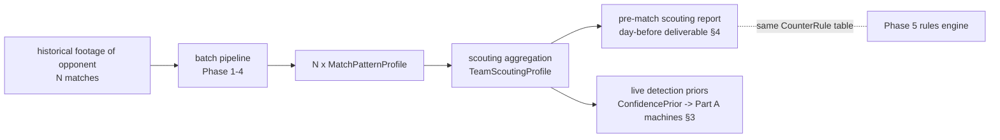

# Opponent Scouting Profiles: Multi-Match Tendencies, Live Priors, Pre-Match Reports

**Status:** design + implementation. The aggregation math, the priors math, and the
report schema/adapter are implemented and tested under
[`/pipeline/scouting`](../pipeline/scouting/); what remains open is exactly what must
remain open (the footage source question, §5, and Phase 5 engine completion for
rendered recommendations, §4.2).

**Position in the architecture:** this is the third consumer of Phase 4 output and the
bridge between the batch and live worlds:



A `TeamScoutingProfile` is the multi-match sibling of the single-match
`MatchPatternProfile`: the latter says *what they did in that match*, the former says
*what they tend to do* — with the uncertainty of that claim carried explicitly, because
"tend" is a statistical statement and pretending otherwise is how scouting reports lie.

---

## 1. What is being aggregated

Input: N historical matches of the scouted team, each run through the existing batch
pipeline, yielding N `MatchPatternProfile`s plus a date and which side the scouted team
was. Everything below consumes only Phase 4 aggregates — scouting never reaches into
frames or features, the same layering rule Phase 5 obeys.

One deliberate rule at the flattening step
([`models.observations_from_profile`](../pipeline/scouting/models.py)): **a pattern
absent from a match profile becomes an explicit zero observation**, not a skipped row.
"They never once sat in a low block across 8 matches" is exactly as informative as
"they pressed in all 8"; skipping absences would bias every prevalence estimate toward
1 and make rare patterns look like habits.

## 2. Aggregation design

Implemented in [`aggregate.py`](../pipeline/scouting/aggregate.py); all pure-stdlib
arithmetic on purpose — every scouting claim must trace back to auditable sums.

### 2.1 Recency weighting

Exponential decay with a half-life (default 60 days), times a footage-volume factor:

    w_i = 0.5^(age_days_i / 60) × min(1, observed_minutes_i / 60)

| match age | recency weight |
|---|---|
| last week | 0.92 |
| 1 month | 0.71 |
| 3 months | 0.35 |
| 8 months | 0.06 |

So the brief's requirement — last week's match matters, the 8-month-old one barely —
falls out without a hard cutoff, and a 15-minute broadcast fragment counts a quarter of
a full match regardless of its date. Tendencies change with managers, transfer windows
and tactical fashions; 60 days is a defensible default and a config field
(`ScoutingConfig.half_life_days`), not a claim. Teams under a new head coach are a
known failure of *any* decay constant — the report's per-match rows (§2.4) are the
mitigation, plus the analyst simply excluding pre-regime matches from the input.

### 2.2 Uncertainty: two numbers, both mandatory

- **Effective sample size** `n_eff = (Σw)²/Σw²` (Kish). Eight well-observed recent
  matches ⇒ n_eff ≈ 6–7; one recent match plus seven stale fragments ⇒ n_eff ≈ 1–2.
  Every downstream gate (rules eligibility, prior activation) checks n_eff, never raw
  match count.
- **Prevalence with a Wilson interval.** Per match, the pattern is *present* iff its
  rate clears a per-pattern floor AND its mean confidence clears a quality floor (one
  noisy low-confidence episode is not a sighting). The weighted share of present
  matches is the tendency's `prevalence`, and it ships with a Wilson score interval at
  n_eff. This is where "seen in 2 of 3" and "seen in 8 of 10" — similar point
  estimates — get honestly different lower bounds (0.21 vs 0.49; tested). Wilson over
  Wald because scouting constantly hits p̂ = 1.0 ("pressed in every match we have"),
  exactly where Wald degenerates to a zero-width interval and Wilson still says
  [0.57, 1.0] at n = 5.

Confidence and intensity aggregate only over matches where the pattern appeared —
averaging zeros in would report "their press is weak" when the truth is "they press
rarely", and prevalence already owns the second statement.

### 2.3 Opponent-strength normalisation: considered and (for v1) refused

The concern is real: teams press more against weaker opposition, sit deeper against
stronger — so a tendency estimated from a soft run of fixtures overstates what we'll
face. The honest v1 answer is that we cannot correct for this, for three stacking
reasons:

1. **No strength signal in our data.** We don't even observe the *score* (no event
   data — batch design §1.2); opponent strength would have to come from an external
   rating source we haven't validated.
2. **No degrees of freedom.** With 3–10 input matches, fitting even a one-parameter
   strength adjustment consumes a third of the sample to estimate a nuisance variable.
3. **Silent corrections are worse than visible heterogeneity.** A normalised number
   the analyst can't decompose is a number they can't challenge.

What v1 does instead: every tendency retains its **per-match rows** (date, weight,
rate, present, analyst-supplied `context_tags` like `"vs_top_side"`, `"away"`), so
heterogeneity is *displayed* rather than corrected — "presses in 6 of 8; the two
exceptions were the top-two away fixtures" is a sentence the analyst assembles in five
seconds from the report, and it is better scouting than any regression we could fit at
this sample size. If the match library ever grows to where segmentation is honest
(≥ ~3 matches per stratum), segmented aggregates by context tag are a mechanical
extension of the existing weighting.

### 2.4 What a tendency looks like

`PatternTendency` (per pattern): weighted rate/90 + weighted spread (consistency),
prevalence + Wilson CI, n_eff, weighted confidence/intensity (when present), weighted
metadata breakdowns (e.g. overload side), and the per-match transparency rows. Rare
patterns are not excluded — they are *diluted* (a one-match low block against 6 matches
of weights contributes its weight's worth of rate), and the rules' own `min_rate_per_90`
thresholds then decide actionability. Exclusion happens only on evidence sufficiency
(n_eff), never on the value itself.

---

## 3. Feeding live detection: priors that cannot outrun evidence

### 3.1 Mechanism (implemented: [`priors.py`](../pipeline/scouting/priors.py))

Per pattern, the tendency becomes a Jeffreys-shrunk estimate of "probability this
opponent shows the pattern in a match":

    p_team = (prevalence · n_eff + 0.5) / (n_eff + 1)

("7 of 8" ⇒ 0.83 at n_eff ≈ 6.5; "2 of 2" ⇒ 0.83 with n_eff 2 — shrinkage keeps small
samples from claiming certainty; an empty profile gives 0.5 with n_eff 0, which the
gates below then ignore entirely.)

At match time, a `PriorAdjuster` — implementing Part A's `ConfidencePrior` protocol —
computes one number, the **log-odds shift**:

    λ     = n_eff / (n_eff + n₀)              n₀ = 4 pseudo-matches; λ = 0 if n_eff < 2
    shift = clamp(λ · [logit(p_team) − logit(p₀)], ±κ)     κ = 0.85

where p₀ is the league-baseline prevalence for the pattern (config default 0.35 per
pattern until we have profiled enough teams to estimate it — an honest bootstrap gap,
recorded in the config docstring).

The shift is applied to exactly two things:

1. **Reported confidence**: `confidence = σ(logit(raw) + shift)`. Log-odds is chosen
   because it is self-limiting at the scale's ends: the maximal capped shift moves a
   0.50 raw confidence to 0.70, but moves 0.05 only to ~0.11 (tested) — a prior can
   sharpen a genuine borderline call, it cannot conjure an alert out of noise.
2. **Alert earliness**: `provisional_after_s` scales by `1 − 0.25·(shift/κ)`, i.e.
   within [0.75×, 1.25×]. A press-heavy opponent's press alerts fire ~0.4 s earlier;
   an out-of-character pattern waits ~0.4 s longer before the first provisional.

Worked example (the design brief's "presses high 70% of the time" opponent): 7 of 9
recent matches ⇒ prevalence 0.78, n_eff ≈ 6.5 ⇒ p_team ≈ 0.79, λ ≈ 0.62,
raw shift ≈ 0.62 × (1.32 − (−0.62)) ≈ 1.20 → **capped to 0.85**. Live: a developing
press with raw confidence 0.45 displays 0.66, and its first provisional fires at
~1.1 s of sustained evidence instead of 1.5 s. Meanwhile a *low block* by this same
opponent (never seen in 9 matches, p_team ≈ 0.07): shift ≈ −0.85, a raw 0.45 displays
0.26, and the alert waits 1.9 s — the system demands stronger live evidence for
out-of-character claims, which is precisely the scouting-informed behaviour we want,
*bounded* (next section) so it can never become blindness.

### 3.2 What the prior may never touch

The confirmation-bias risk — a system that sees what it expects — is handled
structurally, not by hoping the constants are small. Enforced by the Part A machine
design and pinned by tests (`test_scouting_priors.SafeguardsTest`):

| Safeguard | Enforced where |
|---|---|
| per-frame scores and episode membership are untouched — live episode *geometry* is batch-identical, priors or not | `ConfidencePrior` protocol has no access; parity tests |
| shift hard-capped at κ = 0.85 logits (0.50 → 0.70 max) | `PriorAdjuster` |
| CONFIRMED always requires **raw** confidence ≥ 0.40 — no prior buys confirmation, no prior vetoes strong evidence | machine checks `confirm_allowed(raw)`; floor test |
| thin history (n_eff < 2) ⇒ adjuster is exact identity | λ gate |
| every event carries `raw_confidence`, adjusted `confidence`, and the full prior audit block (p_team, baseline, λ, shift) | `LivePatternUpdate` |
| post-match reconciliation (live-architecture doc §6.1) measures realized prior influence per match | JSONL log + batch re-run |

The last row is the systemic check: if reconciliation shows prior-adjusted instances
retracting more often than neutral ones, κ comes down. The constants (κ, n₀, floor) are
config, and the honest statement is that their *values* are educated guesses pending
that measurement loop — but the *structure* (cap + floor + identity-when-thin + dual
logging) is what makes any value of them safe to run.

### 3.3 Asymmetry note

A positive prior mostly changes *presentation* (earlier, more confident provisionals);
it cannot change what confirms. A negative prior is the more dangerous direction
(suppressing a real, novel tactic — say, the opponent unveils a press they never showed
on film). Two properties bound it: the negative shift also caps at κ (a raw 0.45 never
displays below ~0.26), and confirmation is raw-floor-based, so a genuinely sustained
novel pattern confirms on schedule regardless — the prior can only make its
*provisional* phase quieter, by at most 0.4 s of extra wait and a bounded confidence
markdown, and the CONFIRMED event lands with full batch-parity confidence.

---

## 4. The pre-match deliverable

### 4.1 The scouting report (implemented: [`report.py`](../pipeline/scouting/report.py))

Generated the day before, from footage alone — no live system involved. Schema
`scouting-report/v1` (JSON; the Kotlin UI renders it):

```jsonc
{ "schema": "scouting-report/v1",
  "team": "FC Example", "as_of": "2026-07-14",
  "n_matches": 8, "total_observed_minutes": 512.4,
  "matches": [ { "match_id": "…", "date": "2026-07-05", "age_days": 9,
                 "observed_minutes": 64.2, "weight": 0.87,
                 "context_tags": ["away"] }, … ],
  "tendencies": [
    { "pattern": "high_press", "rate_per_90": 9.4, "rate_spread": 2.1,
      "prevalence": 0.78, "prevalence_ci": [0.45, 0.94], "seen_in": "7 of 8",
      "n_eff": 6.1, "rules_eligible": true,
      "mean_confidence": 0.66, "mean_intensity": 0.58,
      "breakdowns": { "trigger": { "open_play": 31.2, "restart": 9.8 } },
      "per_match": [ { "match_id": "…", "date": "…", "weight": 0.87,
                       "rate_per_90": 11.0, "present": true,
                       "context_tags": ["away"] }, … ] }, … ],
  "recommendations": [ /* rendered CounterRule output, §4.2 */ ],
  "caveats": [ "Rates are per OBSERVED 90 …" ] }
```

Three deliberate properties: **per-match attribution** in every tendency (the §2.3
strategy made visible); **`caveats` filled by the builder from actual evidence
sufficiency** (thin library, below-bar patterns), to be rendered *with* the report, not
behind a disclosure; and the offside-trap line-management tendency (batch design §3.5)
belongs here — as flagged there, the *aggregate* line behaviour is the robust artifact
and the pre-match report is its natural home, while its live event channel stays
demoted. (Aggregating the `MatchPatternProfile.tendencies` blocks across matches is a
mechanical extension not yet implemented — noted, not forgotten.)

### 4.2 Reusing the Phase 5 engine — one rules table, two triggers

The recommendation mechanism is unchanged, which is the point of the events/profile
split: the engine consumes a `MatchPatternProfile`, so
`scouting_profile_as_match_profile(profile, as_side)` adapts the aggregate into that
exact shape (weighted rate → `rate_per_90_observed`, total event count → `count`,
weighted breakdowns rounded back to int counts for `where` filters), gated on
`n_eff ≥ 2` so no rule ever fires off one stale match. The analyst's counter-strategy
YAML — authored once — drives both the pre-match report and the post-match analysis;
rules whose thresholds encode "often enough to gameplan against" mean the same thing
against a tendency as against a match, because both are rates per observed 90.

What does **not** carry over, stated rather than faked: `Evidence.clip_spans` is
single-match-shaped (`(start_s, end_s, period)`), and a scouting recommendation's
evidence lives in several matches. The adapter therefore leaves `events` empty, the
report's per-match rows carry the attribution, and extending `Evidence` with
match-qualified spans (so a pre-match recommendation can deep-link clips across the
footage library — the feature that would make this report genuinely great) is recorded
as a Phase 5 v2 schema change.

The engine itself is still skeleton (Phase 5 status), so `build_scouting_report` takes
rendered recommendations as an input rather than reaching around the unfinished
interface; wiring is one call once `RecommendationEngine.recommend` exists.

### 4.3 Scouting report vs in-game recommendations

Same rules, different epistemics, different UI register: the pre-match report says
"across their last 8 matches, they tend to…" (tendency + uncertainty + per-match
receipts); the in-game panel (Phase 5 over live/current-match data) says "today,
they are…". The report is the plan; live is the deviation detector — and the §3 priors
are exactly the plan informing the deviation detector, capped so it can never override
what today's match actually shows.

---

## 5. The data problem, honestly

Everything above assumes historical footage of the opponent exists. Reality check:

- **Professional/semi-professional context:** plausible. Clubs at most levels have
  access to opposition footage — league video portals, Wyscout/Hudl-class platforms, or
  plain footage exchange between clubs. *Full broadcast-style* footage (which our
  pipeline needs — wide shots, not pre-cut event clips) is the constraint to verify per
  competition.
- **This project today:** aspirational. We have SoccerNet research data, not a pipeline
  of the next opponent's last eight matches. The scouting layer is built now because
  its math is footage-independent and its interfaces shape Part A; its *inputs* arrive
  whenever the batch pipeline starts eating real matches at volume.

Design consequence — the system degrades gracefully by construction, verified by tests
at every rung:

| library size | behaviour |
|---|---|
| 0 matches | empty profile; report says so in `caveats`; **live priors: exact identity** — the live system runs unchanged, scouting is strictly additive |
| 1–2 matches | tendencies computed and reported with "indicative at best" caveat; n_eff < 2 ⇒ **no rule triggers, no priors** |
| 3–5 matches | rules eligible; priors active but weak (λ ≈ 0.4–0.6, rarely near the cap) |
| 6–10 matches | the design target: n_eff ≈ 5–8, priors meaningful, prevalence intervals tight enough to say "tendency" without blushing |

No component below this layer knows whether scouting exists; the only coupling is the
optional `ConfidencePrior` handed to a detector machine, and `None` is a first-class
value for it.

## 6. Implemented vs. open

| Piece | Status |
|---|---|
| observation flattening (explicit zeros, side selection) | **implemented + tested** |
| recency/volume weights, n_eff, Wilson intervals | **implemented + tested** (known-value tests) |
| tendency aggregation incl. breakdowns, per-match rows | **implemented + tested** |
| `PatternPrior` + `PriorAdjuster` (cap, floor, λ gate, audit block) | **implemented + tested**, incl. integration with Part A's live machines |
| report schema + builder + caveats | **implemented + tested** |
| adapter into Phase 5 profile shape | **implemented + tested** |
| rendered recommendations in the report | blocked on Phase 5 engine implementation |
| cross-match tendency aggregation for non-event tendencies (offside-trap line profile) | not yet implemented (§4.1) |
| per-pattern league baselines p₀ | config defaults until a team library exists (§3.1) |
| footage ingestion at volume | the real open question (§5) |
