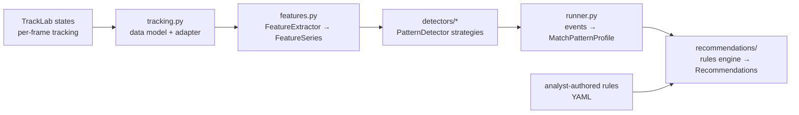

# Phase 4–5 Design: Tactical Pattern Detection & Counter-Strategy Recommendations

**Status:** designed ahead of implementation (project is in Phase 0–1); the **Phase 4 layer is
now fully implemented and green against a synthetic-fixture test suite** (feature extraction,
all five detectors, runner/aggregation — 42 tests including a cross-scenario silence matrix).
Phase 5 remains skeleton. Nothing is validated against *real* tracking output yet; thresholds
carry literature provenance where it exists (§9) and get tuned in the validation loop (§7).

**Scope:** Phase 4 (tactical pattern recognition) and Phase 5 (strategic recommendations) of
the six-stage pipeline in the top-level README. Skeleton code lives under
[`/pipeline/patterns`](../pipeline/patterns/) and
[`/pipeline/recommendations`](../pipeline/recommendations/).

---

## 1. Input contract and data realities

### 1.1 What Phase 3/4 hands us

By the time Phase 4 runs, the sn-gamestate/TrackLab pipeline has produced, per frame:

| Field | Notes |
|---|---|
| timestamp / frame index | effective rate **~2–10 Hz** (broadcast video, downsampled) |
| per-player: pitch position (x, y) in metres | projected via per-frame homography; noisy, occasionally wildly wrong when calibration slips |
| per-player: track id | subject to **ID switches**, especially through occlusions and camera cuts |
| per-player: team affiliation | left/right team classification; occasionally wrong for isolated players |
| per-player: role | goalkeeper / player / referee |
| per-player: jersey number | often missing or misread; useful for stitching tracks, not required by Phase 4 |
| ball: pitch position | least reliable channel — small object, motion blur, frequently missing |

Canonical pitch: **105 × 68 m**, origin at the centre spot, x along the touchline direction,
y along the halfway line.

### 1.2 The four data realities everything downstream must respect

These four constraints shaped nearly every design decision below; they are worth stating
bluntly because most published tactical-analytics methods assume none of them.

1. **Partial observability.** This is broadcast footage, not a stadium multi-camera system.
   The camera follows the ball; typically 12–16 of the 22 players are in frame. Any
   "team-level" quantity (centroid, width, convex hull) is computed on the *visible subset*
   and is biased — e.g. width is systematically underestimated when the far-side winger is
   off-screen. Every frame therefore carries per-team visibility counts, and every detector
   must gate or discount its confidence on them. The good news: visibility is best exactly
   where the ball is, so ball-local signals (pressure, local numerical superiority) are the
   most trustworthy, and far-from-ball signals (defensive line height when the ball is in the
   other half) the least.
2. **Low sampling rate.** At 2–10 Hz, velocities from finite differences are noisy, and
   sub-second events (an offside-trap step-up takes ~1 s) span only a handful of samples.
   Signals must be smoothed; patterns must be defined over windows of seconds, not frames.
3. **Discontinuity.** Broadcast direction cuts to replays, close-ups, and crowd shots. The
   tracking stream is a set of *continuous spans* separated by gaps, not one unbroken
   timeline. Detectors run per-span; rates are normalised per *observed* minute, not per
   match minute.
4. **No event data.** We have no pass/shot/tackle stream. Possession, turnovers, and
   "a pass is being played" must all be *inferred* from proximity and ball kinematics —
   with corresponding noise. Standard event-based metrics (PPDA, packing) are out of reach
   in their canonical form; we use tracking-native analogues instead.

### 1.3 Normalisation conventions

Applied once, in the feature-extraction layer, so no detector ever thinks about direction
of play:

- **Resampling.** Raw frames are resampled to a uniform grid (default 5 Hz). Gaps ≤ 1 s are
  linearly interpolated; longer gaps split the match into separate continuous *segments*.
- **Smoothing.** Positions are smoothed (Savitzky–Golay or exponential) before
  finite-difference velocity estimation.
- **Team-relative frame.** For team T with attack direction `dir ∈ {+1, −1}` in the current
  period: `x' = dir·x + 52.5`, `y' = dir·y`. So for every team, **own goal line is x' = 0,
  opponent goal line is x' = 105, and "left" (y' > 0) is the attacking team's left** — the
  way analysts and commentators use the word. All team-shape features are stored in this
  frame; ball position is stored in absolute pitch coordinates with helpers to convert.
- **Halves.** Attack direction flips at half-time; period id travels with every frame.

---

## 2. Signal catalog (feature layer)

The feature layer turns raw tracking frames into a per-frame feature vector; detectors only
ever see these features, never raw tracking. Full field list in
[`pipeline/patterns/features.py`](../pipeline/patterns/features.py).

### 2.1 Per-team shape signals

| Signal | Definition | Robustness notes |
|---|---|---|
| `centroid_x`, `centroid_y` | mean position of visible outfield players (team-relative) | biased by off-screen players; report `n_visible` alongside |
| `width` / `depth` | max–min spread across / along attack axis | width badly underestimated when far side off-screen |
| `hull_area` | convex hull area of visible outfield players | classic compactness measure (Low et al. 2020 review); same visibility bias |
| `stretch_index` | mean distance of players to own centroid | smoother alternative to hull area |
| `def_line_height` | distance from own goal to the **2nd-deepest** outfield player (deepest is often a lone recovering defender or an error; GK excluded) | only meaningful when the back line is on-camera — i.e. when play is in that team's half or near it. Note this deviates from FIFA's EFI convention (deepest player of the deepest unit); the second-last-defender form matches how line-break research defines the line (Yagi et al. 2025) and is more robust to stragglers — deviation deliberate, documented here |
| `def_line_flatness` | std of x' of the deepest 4 outfield players | used for line-coordination signals |
| `def_line_velocity` | d/dt of `def_line_height` | very noisy at low Hz; needs smoothing; central to offside-trap detection |
| `n_behind_ball` | visible outfielders goal-side of the ball | key low-block / rest-defence signal |

### 2.2 Ball, possession, and transition signals

| Signal | Definition | Robustness notes |
|---|---|---|
| `ball.x`, `ball.y`, `ball.speed`, `ball.vx` | smoothed ball kinematics | ball frequently missing; carry a validity flag, never interpolate through long gaps |
| `possession.state` | HOME / AWAY / CONTESTED / DEAD | **inferred**: nearest player within ~2 m holds it, with hysteresis (a new holder must be established for ~0.5–1 s before the state flips) to prevent flicker |
| `possession.time_since_turnover` | seconds since possession last flipped | drives counter-attack and (future) counter-press detection |
| ball progression speed | d/dt of ball x' in the *possessing* team's frame | the backbone of counter-attack detection |

Possession inference is the single most consequential derived signal — counter-attack and
press detection both sit on top of it. It will be wrong around deflections, aerial duels,
and ball-tracking dropouts. Budget explicit validation time for it alone.

### 2.3 Pressure and local-superiority signals

| Signal | Definition | Robustness notes |
|---|---|---|
| `nearest_defender_dist` | distance from ball to nearest out-of-possession player | ball-local ⇒ most reliable family of signals we have |
| `defenders_within_5m` / `15m` | count of out-of-possession players within radius of ball | 5 m ≈ actively engaging; 15 m ≈ press support |
| `press_closing_speed` | −d/dt of mean distance of the 3 nearest defenders to the ball | positive = collapsing on the ball; tracking-native stand-in for pressing intensity (cf. Andrienko et al.'s pressure model, simplified for low Hz) |
| `local_superiority_10m` | (teammates − opponents) within 10 m of ball, from the possessing team's perspective | overload detection near the ball |
| `lane_occupancy` | player counts per team in 5 vertical lanes (13.6 m each): wide-left, half-space-left, centre, half-space-right, wide-right (attacking perspective) | far-side lanes undercounted; overload detection uses ball-side lanes where visibility is good |

### 2.4 Data-quality signals

Per frame: visible outfield count per team, ball validity, and an overall quality score
∈ [0, 1]. Detectors consume quality directly — it multiplies into event confidence and
gates detectors that need signals currently off-camera.

### What we deliberately left out (for now)

- **Formation detection** (Shaw & Glickman-style role clustering) — valuable, planned, but a
  separate work item; nothing in Phase 4 v1 depends on it.
- **Pitch control / space-value models** (Spearman; Fernández & Bornn) — powerful but heavy,
  and dubious under partial observability (you can't model space you can't see). Revisit if
  we ever get full-pitch tracking.
- **Event-based metrics** (PPDA, packing) — require event data we don't have.

---

## 3. Pattern detectors

### 3.1 Shared detection idiom

All five detectors follow the same shape, which is what makes the Strategy pattern honest
rather than cosmetic:

1. **Per-frame candidate score** — combine 2–5 features into a score ∈ [0, 1] using **soft
   thresholds** (logistic squash around the threshold) rather than hard cuts. Soft scores
   make confidence meaningful, make tuning less brittle, and give us a clean migration path
   to learned weights later (§3.8).
2. **Episode extraction with hysteresis** — threshold the score series, then merge gaps
   shorter than `merge_gap` and drop episodes shorter than `min_duration`. Patterns are
   *episodes* (spans), never single frames.
3. **Confidence and intensity** — each `PatternEvent` carries both, and they mean different
   things:
   - `confidence` ∈ [0, 1]: how sure we are the pattern *occurred at all* = (rule margin —
     how far past thresholds) × (data quality — visibility, ball validity, segment length).
   - `intensity` ∈ [0, 1]: how *strong* the pattern was (a 6-man press is more intense than
     a 3-man press at identical confidence).
4. **Segment awareness** — detectors run within continuous tracking segments only; an
   episode never spans a broadcast cut.

### 3.2 High press

**Concept.** Out-of-possession team defends aggressively high, pressing the opponent's
build-up deep in the opponent's territory.

**Heuristic.** For team D out of possession, flag frames where all of:
- opponent has possession and ball is deep in *opponent's* territory (opponent's own build-up
  zone: ball beyond D's attacking 70 m line, i.e. within ~35 m of the opponent's goal line);
- D's defensive line is high: `def_line_height ≥ 40 m`;
- D commits bodies: `defenders_within_15m ≥ 3` and `nearest_defender_dist ≤ 4.6 m`;
- D is actively closing: `press_closing_speed > 0.5 m/s`.
Episodes: `min_duration ≈ 3 s`, `merge_gap ≈ 2 s`.
**Intensity:** pressers committed + closing speed + line height.
**Metadata:** trigger context if inferable (goal kick vs open play — from a preceding DEAD
possession state), side of the pitch the press funnels toward.

**Limitations.**
- Distinguishing a *high press* from a *counter-press/gegenpress* (immediate press after
  losing the ball, cf. Bauer & Anzer 2021) matters tactically; v1 separates them only by
  `time_since_turnover < ~5 s`, which is crude. Counter-press deserves its own detector
  later.
- Mid-block pressing traps (letting the ball into a zone, then springing) will partially
  leak into or out of this definition — the high-press/mid-press boundary is genuinely fuzzy
  even between human analysts.
- At goal kicks the camera often shows a wide tactical shot (good) but sometimes cuts to
  close-ups (no back-line visibility ⇒ line-height gate fails ⇒ discount, don't drop).

### 3.3 Low block

**Concept.** Sustained deep, compact out-of-possession shape.

**Heuristic.** For team D out of possession, flag frames where:
- opponent possession, ball in D's half;
- `def_line_height ≤ ~28 m`;
- compact: `width ≤ ~40 m` **and** `hull_area` in the bottom quartile of D's own
  distribution for the match (adaptive threshold — absolute hull-area cutoffs transfer badly
  between teams);
- numbers home: `n_behind_ball ≥ 8` (of visible players; gate on `n_visible ≥ 9`).
Episodes: `min_duration ≈ 12 s` — a low block is a *state*, not a moment; short deep spells
are just normal defending.
**Intensity:** inverse line height × compactness × duration.

**Limitations.**
- **Deliberate low block vs being pinned back** is the classic ambiguity: a team parking the
  bus and a team failing to escape pressure look identical in these signals. Match-level
  aggregation (does it recur from the opening minutes? does it persist at 0–0?) is the v1
  disambiguator; true intent is unknowable from positions alone.
- Visibility is actually *favourable* here (play near the box ⇒ wide camera framing ⇒ most
  defenders on-screen), so this should be one of the most reliable detectors.

### 3.4 Flank overload

**Concept.** In-possession team commits numerical superiority to one flank to create 2v1s /
combination play.

**Heuristic.** For team A in possession, flag frames where:
- ball in a wide lane (|y'| > 13.6 m) in A's middle or final third (`ball x' ≥ 35 m`);
- ball-side wide + half-space lanes contain ≥ 3 of A's players, and A has local superiority:
  `local_superiority_10m ≥ +1`;
- A's shape leans over: `centroid_y'` displaced ≥ ~5 m toward that flank.
Episodes: `min_duration ≈ 3 s`; aggregate per side (attacking-perspective left/right) over
the match — the *recurrence by side* is the tactically interesting output ("9 of their 12
overload episodes were on their left").

**Limitations.**
- The camera follows the ball, so *ball-side* counts are trustworthy — but the tactically
  richer variant, **overload-to-isolate** (load the left to free the right winger), is
  literally invisible: the isolated far-side player is off-camera and the switch pass that
  exploits it is an event we can't see. v1 detects the overload, not its purpose.
- Distinguishing a deliberate overload from a throw-in huddle or a corner-adjacent scramble
  needs dead-ball filtering (possession DEAD state around restarts).

### 3.5 Offside trap / line step-up

**Concept.** The back line steps up in unison as (or just before) an opponent's forward pass
is struck, to catch runners offside.

**Heuristic (attempted).** For team D out of possession, opponent in D's half within ~35 m
of D's line:
- rapid line rise: `def_line_velocity ≥ +1.5 m/s` sustained ~1 s (`def_line_height` gains
  ≥ ~2 m);
- in unison: `def_line_flatness` ≤ ~2.5 m held through the step (a flat line that rises
  together stays flat). Per-player velocity dispersion was the original sketch, but at low
  Hz with track switches it is too noisy to gate on — positional flatness is the practical
  proxy the implementation uses;
- context: ball forward-speed spike shortly after (proxy for "a through ball was played") —
  corroborating metadata that boosts confidence, never required.

**Honest assessment — this is the weakest detector, by design intent kept anyway.**
At 2–5 Hz a ~1 s step-up spans 2–5 samples of a *derivative* of a noisy line estimate whose
member players may be partially off-camera; and the confirming outcome (flag/whistle) is
invisible without event data. Expect high false-positive rates. The fallback deliverable —
which may end up being the *primary* one — is a **line-management tendency profile** rather
than discrete trap events: distribution of line height vs ball distance, step-up frequency,
drop-vs-hold behaviour under through-ball threat. That aggregate is robust at low Hz and is
what actually feeds a "play early balls in behind" recommendation. The detector class
therefore exposes both: (weak) events and (robust) tendency aggregates.

### 3.6 Counter-attack

**Concept.** Fast transition after regaining possession, progressing the ball toward the
opponent's goal before the defence reorganises (cf. Vogelbein et al.'s defensive-reaction
framing, inverted).

**Heuristic.** Anchor on turnovers (possession flips that persist ≥ 2 s). Within a 14 s
window after a turnover won by team A:
- ball progresses ≥ ~16 m toward the opponent goal, or reaches the final third, with mean
  progression speed ≥ ~4 m/s;
- runners: ≥ 2 of A's players with forward velocity ≥ ~5.5 m/s (displacement-based at our Hz);
- disorganised opponent (supporting, not required): fewer opponents goal-side of the ball
  than their match median.
**Intensity:** territory gained / time, runner count.
**Metadata:** turnover location (a team that counters from *deep* turnovers is telling you
something different from one that counters from a high press — this feeds Phase 5 directly).

**Limitations.**
- Inherits every weakness of possession inference; false turnovers (deflection, 50/50 bobble)
  create false counter windows. Mitigate with the 2 s persistence rule; accept some loss.
- Broadcast replays after exciting moments — which counters are — will truncate exactly the
  sequences we care about. Rates will undercount; report per observed minute and say so in
  the UI.
- "Counter-attack vs fast build-up vs hopeful clearance" is a spectrum; the progression-speed
  threshold slices it arbitrarily. A learned sequence model does better here eventually.

### 3.7 Cross-cutting limitations of the rule-based approach

Stated once, applies to all detectors:

- **Thresholds don't transfer.** A 40 m "high line" is high in League Two and average for a
  possession-dominant top-flight side. Mitigations in order: (a) adaptive per-match
  percentile thresholds where possible, (b) config-per-competition, (c) learned thresholds
  once we have labels.
- **Intent is not observable.** We detect *shapes and dynamics*, and name them with intent
  words ("trap", "overload", "block"). The mapping is probabilistic and sometimes wrong in
  ways no threshold fixes.
- **Co-occurrence.** Patterns overlap (a high press producing a turnover flows into a
  counter). Detectors are deliberately independent and *allowed* to emit overlapping events;
  interpretation of combinations happens in aggregation/Phase 5, not by inter-detector
  coupling.

### 3.8 Migration path to ML (designed-in, not bolted on)

The feature layer is the contract: a `FeatureSeries` is just a time-indexed feature matrix.
That means:

1. **Now:** hand-tuned soft-threshold detectors (this document).
2. **Once the analyst has labelled ~50–100 clips per motif** (annotation loop, §7): fit the
   soft-threshold weights / replace a detector's scoring function with a small classifier
   (logistic regression / gradient boosting on windowed features) behind the *same*
   `PatternDetector` interface — the Strategy pattern means swapping one class, nothing else
   moves.
3. **Later:** sequence models (HMMs / temporal CNNs / transformers) over the same feature
   windows for the patterns where rules struggle most: offside trap, counter vs fast
   build-up, press *type* classification.

---

## 4. Architecture

### 4.1 Layers



| Module | Responsibility |
|---|---|
| `pipeline/patterns/tracking.py` | raw-data model (`TrackingFrame`, players, ball, match meta) + adapter from TrackLab output. **Only** module that knows about sn-gamestate's format. |
| `pipeline/patterns/features.py` | normalisation (resample, smooth, team-relative frame), possession state machine, per-frame `FrameFeatures`, time-indexed `FeatureSeries` with windowing |
| `pipeline/patterns/detectors/base.py` | `PatternDetector` ABC, `PatternEvent`, registry, shared episode/soft-threshold helpers |
| `pipeline/patterns/detectors/*.py` | one Strategy class per motif |
| `pipeline/patterns/runner.py` | orchestration: features → all registered detectors → `MatchPatternProfile` (per-pattern aggregates) |
| `pipeline/recommendations/models.py` | `CounterRule`, `TriggerSpec`, `Recommendation`, `SquadProfile` |
| `pipeline/recommendations/rules.py` | rule repository: YAML loading, validation, starter rules |
| `pipeline/recommendations/engine.py` | trigger matching, scoring, conflict resolution, evidence rendering |

### 4.2 Key interface decisions (and why)

- **Detectors receive the whole `FeatureSeries` (segment-aware), not pre-cut windows.**
  Episode lengths differ per pattern by an order of magnitude (3 s press vs 20 s block), so
  a runner-imposed fixed window would be the wrong abstraction. The base class provides
  shared windowing/hysteresis helpers instead; the "shared time-windowed representation"
  the detectors operate on is the `FeatureSeries` itself.
- **Detectors declare `required_features`** (dotted names, `team.` prefix meaning
  both sides). The runner can validate availability and skip/flag detectors when a feature
  can't be computed for a match, instead of crashing mid-run.
- **Config as dataclasses, one per detector**, serialisable, with every threshold a named
  field. Tuning = editing config, not code; sweeps in the validation harness iterate configs.
- **Events are the atoms; profiles are the aggregate.** `PatternEvent` (span, team,
  confidence, intensity, metadata) is what the UI uses to jump to video clips.
  `MatchPatternProfile` (per pattern × team: count, rate per observed 90, intensity/
  confidence stats, side/phase breakdowns) is the *only* input Phase 5 sees — the
  recommendation engine never touches frames or features, which keeps the Phase 4/5 boundary
  clean and independently testable.

### 4.3 Output schemas

Phase 4 persists two JSON documents per match (schema versioned — these are the
pipeline↔UI contract):

```jsonc
// events.json (excerpt)
{ "schema": "pattern-events/v1",
  "match_id": "...",
  "events": [ { "pattern": "flank_overload", "team": "away",
                "start": 1043.2, "end": 1051.0,
                "confidence": 0.74, "intensity": 0.6,
                "metadata": { "side": "left", "n_attackers": 4 } } ] }

// profile.json (excerpt)
{ "schema": "pattern-profile/v1",
  "observed_minutes": 61.5,
  "aggregates": [ { "pattern": "flank_overload", "team": "away",
                    "count": 12, "rate_per_90_observed": 17.6,
                    "mean_confidence": 0.68, "mean_intensity": 0.55,
                    "breakdowns": { "side": { "left": 9, "right": 3 } } } ] }
```

---

## 5. Phase 5: rule-based recommendation engine

### 5.1 Design philosophy: data supplies evidence, the analyst supplies strategy

Which counter-strategy beats which pattern is **football knowledge, not a data inference**.
Nothing in tracking data says "against a left-flank overload, double up on their right
winger" — that's coaching judgment about trade-offs the data can't see (squad personnel,
risk appetite, fatigue, the opponent's likely adjustment). The engine's honest job is:

- **fire a rule only when the evidence supports its trigger** (the pattern actually recurred,
  with enough confidence, in this match/sample);
- **quantify and cite that evidence** ("14 left-flank overloads detected, 9 in the first
  half — clips attached") so the analyst can audit the claim in seconds;
- **rank** competing suggestions and **resolve conflicts**;
- and otherwise stay out of the football.

The rules table is therefore *authored content* — the analyst (you) is the domain expert
writing and curating it; the starter rules shipped in code are illustrative placeholders,
not claims. This is also why rules live in **YAML data, not Python logic**: the person
editing them shouldn't need to touch code, and every rule carries `author`/`provenance`.

### 5.2 Rule schema

A `CounterRule` is: **trigger** (predicate over a `MatchPatternProfile`) → **recommendation
template** (content) + **priority** (analyst-assigned weight):

```yaml
- rule_id: double-up-vs-flank-overload
  author: filippos
  priority: 0.8            # analyst judgment of how actionable this is when it fires
  trigger:
    pattern: flank_overload
    scope: opponent          # pattern exhibited by the opponent (vs self: our own habits)
    min_rate_per_90: 6
    min_mean_confidence: 0.5
    where: { side: left }    # metadata breakdown filter, attacking team's perspective
  requires: []               # squad capabilities this advice presupposes (see §5.4)
  recommendation:
    headline: "Double up on their {side} flank (your {mirrored_side})"
    rationale: >
      They overload the {side} flank when building up ({count} episodes,
      {rate_per_90:.0f}/90 observed). Doubling your {mirrored_side}-sided winger onto
      their overlapping full-back blunts the 2v1.
    suggested_actions:
      - "Winger tracks the overlapping full-back; full-back stays on the touchline man"
      - "Nearest CM shuttles across to screen the half-space cutback"
  conflicts_group: null      # rules sharing a group: only the highest-scoring one fires
```

Notes baked into the schema:

- **Perspective handling.** Overload sides are recorded from the *attacking team's*
  perspective (§3.4); templates get both `{side}` and `{mirrored_side}` so the rendered text
  can say "their left / your right" and never make the coach do the mental flip.
- **`scope: self`** enables the mirror use-case: rules about *our own* detected tendencies
  ("we get pinned into a low block for 20+ min stretches — rehearse an out-ball routine").
- **Trigger thresholds are per-rule**, because "how often is often enough to gameplan
  against" is itself analyst judgment and differs per pattern.

### 5.3 Engine mechanics

`RecommendationEngine.recommend(profile, for_team, squad_profile) -> list[Recommendation]`:

1. **Match** every rule's trigger against the profile (scope-resolved to the right team's
   aggregates; metadata `where` filters applied to breakdowns).
2. **Score** = rule `priority` × trigger strength (how far above thresholds the observed
   rate/confidence/intensity are — same soft-margin idea as the detectors, so marginal
   evidence yields low-ranked suggestions rather than binary flapping).
3. **Filter** by `requires` vs the supplied `SquadProfile` (see below); unmet requirements
   demote rather than drop, with the gap stated ("assumes a target striker").
4. **Resolve conflicts** within `conflicts_group` (keep the highest score), cap the list.
5. **Render** templates with evidence values and attach `Evidence`: the aggregate numbers
   *plus the underlying `PatternEvent` spans*, so the UI can deep-link every recommendation
   straight to the video moments that justify it. That link — claim → clips — is the
   feature that earns a coach's trust, and it falls out of the events/profile split for
   free.

### 5.4 Where subjectivity lives (explicitly)

| Decision | Who owns it |
|---|---|
| what counts as "often enough" to act on | analyst, per rule (`min_rate_per_90`) |
| which counter answers which pattern | analyst (rule content) |
| how actionable/important a suggestion is | analyst (`priority`) |
| whether the advice fits *our* squad | analyst via `SquadProfile` — a small hand-maintained per-team capability sheet (e.g. `has_target_striker`, `wingers_defend_well`); rules declare `requires`. The engine cannot and should not infer your squad's traits from opponent tracking data. |
| whether the pattern really occurred | engine (confidence, from Phase 4) |
| how strong the evidence is | engine (trigger strength, evidence block) |

Future (explicitly out of v1): analyst feedback loop — accept/dismiss actions on
recommendations logged and used to re-weight priorities. Do not attempt to learn rule
*content*; the label volume will never support it and the failure mode (confidently wrong
tactical advice) is the worst one this product can have.

---

## 6. Testing strategy (implemented for Phase 4)

- Detectors are pure functions of (`FeatureSeries`, config) → deterministic, unit-tested
  against **synthetic fixtures**: [`pipeline/patterns/testing/synthetic.py`](../pipeline/patterns/testing/synthetic.py)
  scripts full-22-player textbook scenarios per motif plus deliberate negatives (passive
  build-up, 8 s deep spell, mid block, balanced attack, line drop, slow transition,
  flickering possession, low-visibility press). The suite ([`pipeline/tests/`](../pipeline/tests/),
  42 tests) proves each detector fires on its positive, stays silent on its negatives, and —
  via a **cross-scenario silence matrix** — that no detector fires confidently on another
  motif's scenario. These tests pin the *semantics of the heuristics* before any real data
  exists; run with `python3 -m unittest discover -s pipeline/tests`.
- The feature extractor additionally gets golden-file tests once we have one real TrackLab
  output in `/research`: freeze a short segment's expected features.
- The rules engine (Phase 5, still skeleton) is tested entirely with synthetic profiles —
  no tracking data needed.

## 7. Validation and tuning plan (the no-ground-truth problem)

There is no labelled "this was a high press" dataset for our footage. The plan:

1. **Annotation loop first.** The tool exists: [`/tools/annotator.html`](../tools/annotator.html)
   — a zero-install, single-file video labeller that exports `pattern-events/v1` JSON (the
   same schema the detectors emit), usable on any match clip today. The analyst tags ~50
   clips per motif: present / absent / borderline (`none` label for reviewed negatives).
   This is the single highest-leverage investment in Phase 4; without it, threshold tuning
   is vibes.
2. **Per-motif precision/recall** against those labels; threshold sweeps over detector
   configs (they're dataclasses precisely so a harness can grid-search them).
3. **Face-validity dashboards**: feature time-series (line height, compactness, pressure)
   plotted under the video for spot-checking — catches feature bugs that metrics hide.
4. **Order of attack** (expected reliability, best first): low block → high press →
   counter-attack → flank overload → offside trap.

## 8. References (verified July 2026)

All citations below were verified by fetching and reading the source (full text unless
noted). Industry sources are marked **[industry]**.

**Shape / compactness / blocks**
- Rico-González, Pino-Ortega, Castellano, Oliva-Lozano, Los Arcos (2022). *Reference values
  for collective tactical behaviours based on positional data in professional football
  matches: a systematic review.* Biology of Sport 39(1):110–114. doi:10.5114/biolsport.2021.102921.
  The workhorse numeric source: defence line 22–28 m, width 35–48 m, length 31–46 m,
  stretch index ~7–16 m (defending low end).
- Moura, Martins, Anido, de Barros, Cunha (2012). *Quantitative analysis of Brazilian
  football players' organisation on the pitch.* Sports Biomechanics 11(1):85–96 —
  defending-phase hull medians 774–1158 m².
- Olthof, Frencken, Lemmink (2019). J Strength Cond Res 33(2):523–530 — elite-youth 11v11
  match shape values (~900–1050 m² hull, ~40 m width; read from figures).
- Forcher et al. (2024). Int J Sports Sci Coaching 19(2):757–768 — ball-near subgroup
  compactness discriminates defensive success; whole-team compactness does not.
- FIFA (2022). *Enhanced Football Intelligence* explanation document v1.0 **[industry]** —
  line height / team length / phase definitions (thirds-based, algorithm internals
  unpublished).

**Pressing / possession / transitions**
- Andrienko et al. (2017). *Visual analysis of pressure in football.* Data Mining and
  Knowledge Discovery 31:1793–1839 — directional pressure oval, D_front = 9 m, D_back = 3 m,
  Pr = (1−d/L)^q, empirical q ≈ 2.0–2.25.
- Bauer & Anzer (2021). *Data-driven detection of counterpressing in professional football.*
  DMKD 35(5):2009–2049 — counter-press = press within the defensive transition; 5 s regain
  cut-off; features at 0/1/2 s after ball loss with 10/20/30 m player-count circles; warns
  that a bare 5-yard proximity rule over-detects (72% of transitions).
- Vogelbein, Nopp, Hökelmann (2014). J Sports Sci 32(11):1076–1083 — defensive reaction
  time (continuous; top teams ~1 s faster). Abstract + secondary verification only.
- Link & Hoernig (2017). *Individual ball possession in soccer.* PLOS ONE 12(7):e0179953 —
  nearest-player + trained distance threshold + kick detection (ball acceleration ≥ 4 m/s²).
- Vidal-Codina, Evans, El Fakir, Billingham (2022). *Automatic event detection in football
  using tracking data.* Sports Engineering 25 — possession-zone radius 0.5–1 m on 25 Hz
  data; explicitly endorses enlarging the radius for broadcast-derived tracking (our case).
- StatsBomb **[industry]**: Open Data Specification v1.1 — counterpress = pressure within
  5 s of an open-play turnover; 5-yard (4.57 m) pressure radius (blog/conference material,
  restated in Bauer & Anzer).
- Trainor (2014) **[industry]** — PPDA; confirmed event-data-based, NOT computable from our
  tracking-only pipeline (cited to explain its absence).

**Counter-attacks / speed bands / lanes**
- Yang, Ge, Cui (2025). *An AI framework for counterattack detection and decision-making
  evaluation in football.* Journal of Big Data 12:91 — the only validated tracking-era
  counter-attack rule set found (κ > 0.9 vs analysts): open-play turnover in own half, no
  set pieces, ≥75% of movement toward goal, ball moves ≥16 m forward, duration ≤14 s.
- Gualtieri, Rampinini, Dello Iacono, Beato (2023). Front Sports Act Living 5:1116293 —
  speed-band review: HSR >19.8 km/h (5.5 m/s), sprint >25.2 km/h (7.0 m/s); FIFA competition
  convention 20/25 km/h; explicit "no consensus" caveat.
- Opta/Stats Perform **[industry]** — "direct attack" (starts own half, ≥50% movement toward
  goal, ends shot/box touch; no time limit published) and "direct speed" (metric, no cutoff).
- Spielverlagerung glossary & Coaches' Voice **[coaching convention]** — half-spaces /
  five-corridor scheme; boundaries anchored to penalty-area geometry, no metre widths.
- Yagi, Ichikawa, Ichinose (2025). arXiv:2511.00121 — line-break prediction; defines the
  defensive line via the second-last defender (corroborates our `def_line_height` choice);
  its related work confirms no offside-trap quantification exists.

**Deferred / future work**
- Shaw & Glickman (2019) — formation/role detection (Phase 4 v2).
- Spearman (2018); Fernández & Bornn (2018) — pitch control (deferred; partial observability).
- Bekkers (2025), arXiv:2501.04712 — time-to-intercept pressing intensity (a better v2 basis
  for our closing-speed factor).

## 9. Threshold provenance (July 2026 literature pass)

Every detector default was checked against the literature by a three-track verified research
pass (each claim confirmed by fetching the source; fabrication-guarded). Outcome per
parameter — **REPLACED** means the shipped default changed to the published value:

| Parameter | Default | Provenance |
|---|---|---|
| Low block: line height ≤ | 28 m | **KEPT, source agrees** — top of published 22–28 m defence-line average (Rico-González 2022) |
| Low block: width ≤ | 40 m | **KEPT, source agrees** — elite out-of-possession blocks 38.4–40.75 m (FIFA WC22) |
| Low block: hull fallback ≤ | 700 m² | **KEPT, defensible** — below lowest published defending median (774 m², Moura 2012); no published block threshold exists |
| High press: line height ≥ | 40 m | **KEPT, engine-original** — no published value; bracketed (above 22–28 m norm, below WC22 press examples ≥49 m) |
| High press: pressure radius | 4.6 m | **REPLACED** (was 6 m) — StatsBomb 5-yard pressure radius [industry]; Andrienko's directional 9 m/3 m oval is the v2 upgrade |
| High press: ≥3 within 15 m, closing ≥0.5 m/s, ≥3 s | — | **KEPT, engine-original** — no published equivalents (Bauer & Anzer use 10/20/30 m circles as ML features, not thresholds) |
| Counter-press window | 5 s | **KEPT, source agrees** — StatsBomb spec + Bauer & Anzer + the coaching "five-second rule" |
| Possession radius | 2.0 m | **KEPT, mechanism cited** — published 0.5–1 m on 25 Hz data; Vidal-Codina explicitly endorses enlargement for broadcast tracking |
| Counter: window | 14 s | **REPLACED** (was 10 s) — Yang et al. 2025 |
| Counter: progression ≥ | 16 m | **REPLACED** (was 25 m) — Yang et al. 2025 |
| Counter: speed ≥ 4 m/s, runners ≥ 2 | — | **KEPT, engine-original** — no published cutoffs; consider Yang's ≥75%-directness as an alternative formulation |
| Runner speed (feature) | 5.5 m/s | **REPLACED** (was 4.0) — HSR band entry 19.8 km/h (Gualtieri 2023; FIFA uses 20 km/h). 4 m/s was merely "running" |
| Lanes: 5 × 13.6 m | — | **KEPT, simplification of coaching convention** — five corridors are genuine convention; equal widths are ours (convention implies ~13.8/11/18.3 m) |
| Offside trap: step ≥1.5 m/s, gain ≥2 m | — | **KEPT, engine-original** — absence of any published quantification actively confirmed |

Standing caveats from the pass, worth re-reading before tuning: (a) Bauer & Anzer showed
bare proximity rules over-detect pressing — our factor-product structure is the mitigation,
but real-data precision checks should watch this first; (b) speed bands were built for
10–25 Hz physical-load data — at ~5 Hz our smoothed velocities underestimate peaks, so the
5.5 m/s runner gate is conservative; (c) counter-attack literature disagrees with itself
(Casal 2015 found *longer* transitions more successful) — duration/speed cuts encode a
style choice, not ground truth.
